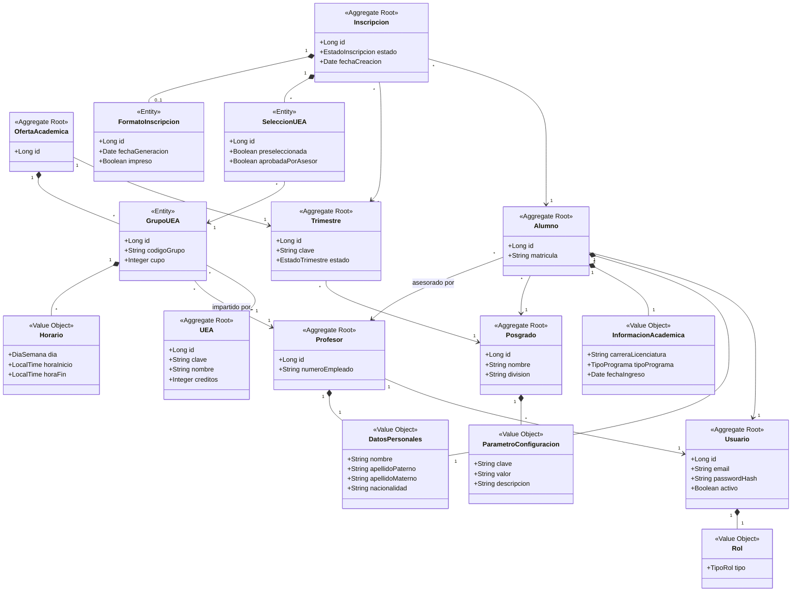

### 1.- Introduction
<!-- Create a description of the document -->

### 2.- Context diagram
<!-- Include the context diagram from the [FILE:ArchitecturalDrivers.md] document, if available. Include a paragraph at the beginning that describes what this diagram shows. -->

### 3.- Architectural drivers
<!-- Include a summary of the drivers described in [FILE:ArchitecturalDrivers.md], including their priorities. You should separate user stories, quality attribute scenarios, concerns and constraints in separate tables. -->

### 4.- Domain model

El modelo de dominio se derivó aplicando Domain-Driven Design (DDD) a partir de los requerimientos funcionales primarios del MVP (HU-01, HU-06, HU-07, HU-08, HU-09, HU-15, HU-21) y los atributos de calidad QA-3 (parametrización de reglas de negocio) y QA-4 (soporte multi-posgrado). Se identificaron los siguientes building blocks de DDD:

- **Aggregate Root (AR):** Entidad raíz que garantiza la consistencia transaccional de su agregado. Es el único punto de acceso externo al agregado.
- **Entity (E):** Objeto con identidad propia que existe dentro de los límites de un agregado y es gestionado por su Aggregate Root.
- **Value Object (VO):** Objeto inmutable sin identidad propia, definido exclusivamente por sus atributos.

Las relaciones de composición (diamante relleno) representan objetos que pertenecen al ciclo de vida de su agregado. Las asociaciones dirigidas (flecha) representan referencias entre agregados distintos.

#### Descripción de los elementos del modelo de dominio

| Elemento | Tipo DDD | Descripción |
| :--- | :--- | :--- |
| **Posgrado** | Aggregate Root | Representa un programa de posgrado de la UAM. Contiene la configuración paramétrica de reglas de negocio, lo que habilita el soporte multi-posgrado requerido por QA-4. |
| **ParametroConfiguracion** | Value Object | Par clave-valor inmutable que externaliza una regla de negocio del posgrado. Permite modificar fechas, cupos y criterios sin cambiar código fuente, en respuesta a QA-3. |
| **Usuario** | Aggregate Root | Cuenta de acceso al sistema. Almacena credenciales y estado de activación. Sirve como identidad de autenticación para todos los actores del sistema, según HU-01. |
| **Rol** | Value Object | Tipo de usuario asignado a una cuenta: COORDINADOR, PROFESOR, ALUMNO, ASISTENTE o PONENTE. Determina las opciones de menú y permisos visibles tras el inicio de sesión, según QA-1. |
| **Alumno** | Aggregate Root | Estudiante inscrito en un programa de posgrado. Agrega sus datos personales e información académica y mantiene la referencia a su profesor asesor. Derivado de HU-15. |
| **DatosPersonales** | Value Object | Datos de identidad de una persona: nombre, apellidos y nacionalidad. Compartido por los agregados Alumno y Profesor. |
| **InformacionAcademica** | Value Object | Datos del programa académico del alumno: carrera de licenciatura de origen, tipo de programa de posgrado y fecha de ingreso. Derivado de HU-15. |
| **Profesor** | Aggregate Root | Miembro del personal académico que imparte materias y asesora alumnos. Se identifica por su número de empleado institucional. Derivado de HU-21. |
| **Trimestre** | Aggregate Root | Periodo académico con una clave identificadora y un ciclo de vida con estados: PLANEACION, EN_INSCRIPCION, EN_CURSO y FINALIZADO. El coordinador lo activa al cargar la oferta académica, según HU-06. |
| **OfertaAcademica** | Aggregate Root | Conjunto de grupos de UEA ofrecidos en un trimestre específico. Se crea al procesar el archivo CSV de horarios y sorteos cargado por el coordinador en HU-06. |
| **GrupoUEA** | Entity | Sección específica de una UEA dentro de la oferta trimestral. Define el código de grupo, el cupo disponible, el profesor asignado y los horarios. Es la unidad seleccionable por los alumnos en HU-07. |
| **Horario** | Value Object | Bloque de tiempo asignado a un grupo: día de la semana, hora de inicio y hora de fin. Derivado de la información mostrada al alumno en HU-07. |
| **UEA** | Aggregate Root | Unidad de Enseñanza-Aprendizaje del catálogo académico. Define la clave, nombre y créditos de una materia. Es independiente de cualquier trimestre u oferta particular. |
| **Inscripcion** | Aggregate Root | Proceso de inscripción de un alumno en un trimestre determinado. Gestiona el ciclo de vida completo: selección de materias por el alumno en HU-07, aprobación por el asesor en HU-08, y generación del formato oficial en HU-09. Sus estados son: PENDIENTE_SELECCION, SELECCION_REALIZADA, APROBADA_POR_ASESOR y FORMATO_GENERADO. |
| **SeleccionUEA** | Entity | Registro de la elección de un grupo de UEA específico dentro de una inscripción. Indica si fue preseleccionada automáticamente por el sistema y si fue aprobada por el asesor. Derivado de HU-07 y HU-08. |
| **FormatoInscripcion** | Entity | Documento PDF generado como resultado de la inscripción aprobada: la "Solicitud de UEA" que se entrega a Sistemas Escolares. Registra la fecha de generación y si ya fue impreso. Derivado de HU-09. |

### 5.- Container diagram
<!-- This section contains the main container diagram, according to the C4 approach. This section should also include a table with the name of the container and its responsibilities. -->

### 6.- Component diagrams
<!-- Component diagrams that correspond to the containers go here, Each component diagram should have an associated table with the name of the components and their responsibilities. -->

### 7.- Sequence diagrams
<!-- For each functional requirement or quality attribute, a sequence diagram will be included here. Below each sequence diagram, there should be a description of what the diagram represents -->

### 8.- Interfaces
<!-- This section will include details about contracts- -->

### 9.- Design decisions
<!-- This section describes the relevant design decisions that resulted in this design. -->

