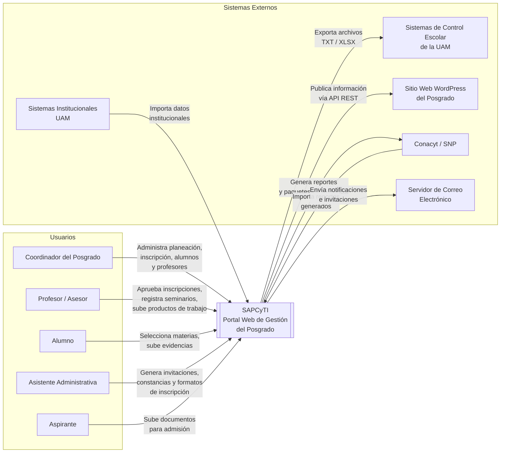
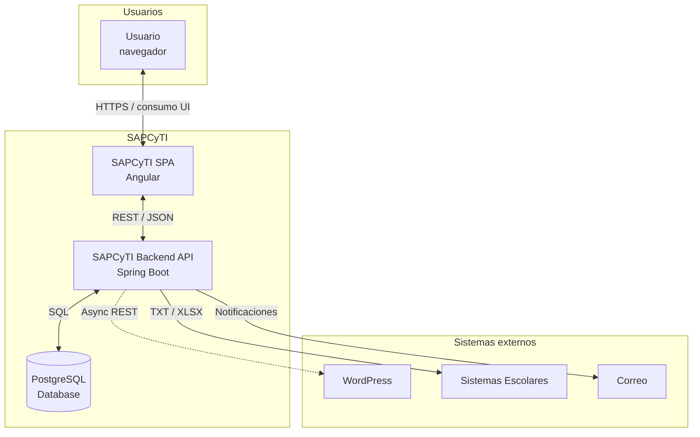
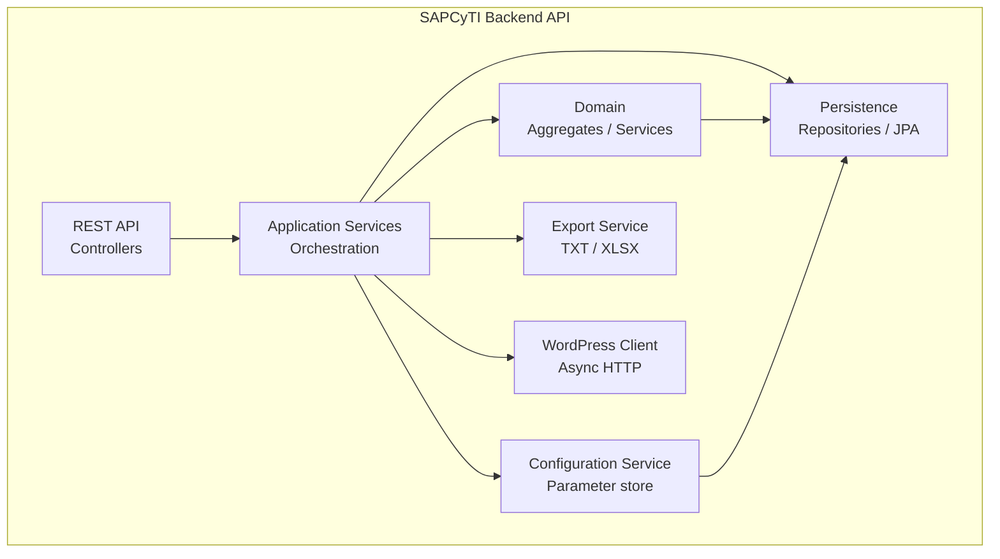
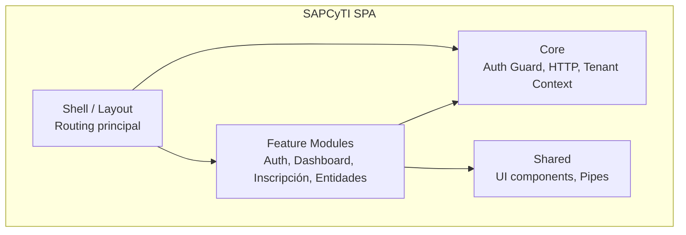
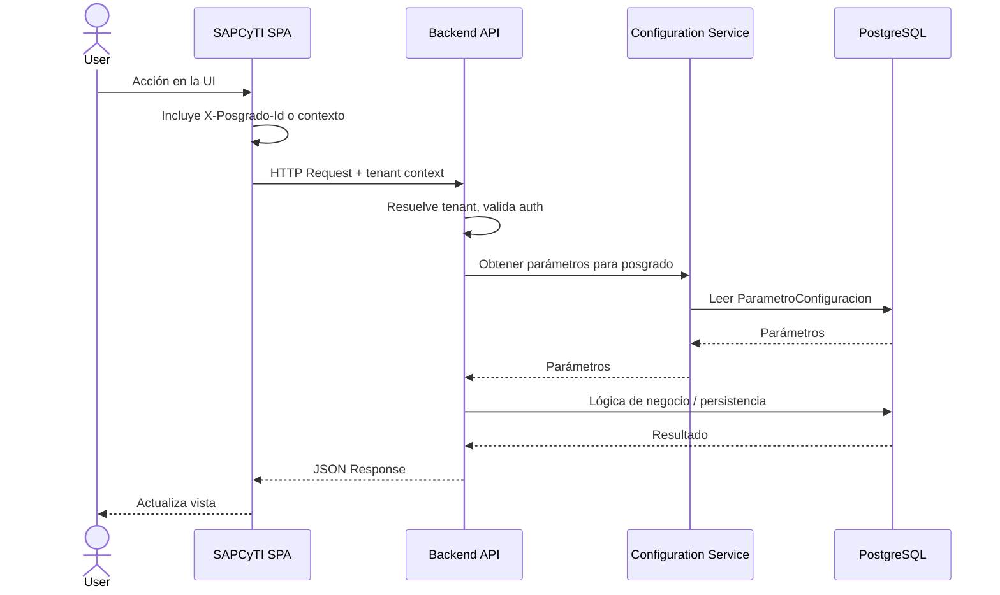

### 1.- Introduction

Este documento describe la arquitectura de software del sistema **SAPCyTI** (Portal de Gestión del Posgrado en Ciencias y Tecnologías de la Información, PCyTI-UAM). Incluye el contexto del sistema, los drivers arquitectónicos, el modelo de dominio, la descomposición en contenedores y componentes, las interfaces principales y las decisiones de diseño resultantes del proceso Attribute-Driven Design (ADD), a partir de la Iteración 1 y las iteraciones subsiguientes.

### 2.- Context diagram

El siguiente diagrama representa a SAPCyTI como una caja negra y muestra los **actores** (tipos de usuario) y los **sistemas externos** con los que interactúa. Los cinco tipos de usuario (Coordinador, Profesor, Alumno, Asistente, Aspirante) acceden al sistema desde el navegador; los sistemas externos incluyen Sistemas de Control Escolar, WordPress del posgrado, Conacyt/SNP, servidor de correo y sistemas institucionales UAM.

### 3.- Architectural drivers

Los drivers arquitectónicos se tomaron de [ArchitecturalDrivers.md](../ArchitecturalDrivers.md). Para el MVP se priorizan las historias de usuario que conforman el flujo de inscripción y la gestión de entidades; en la Iteración 1 se enfatizan las restricciones y los atributos de calidad con mayor impacto estructural (parametrización y multi-posgrado).

#### Historias de usuario (MVP)

| ID | Historia de Usuario |
| --- | ------------------- |
| **HU-01** | Como usuario del sistema, quiero ingresar mediante login y contraseña, para acceder a la pantalla principal con las opciones correspondientes a mi tipo de usuario. |
| **HU-06** | Como Coordinador, quiero seleccionar un trimestre y cargar el archivo CSV de horarios y sorteos, para habilitar la inscripción y que los alumnos visualicen las materias disponibles. |
| **HU-07** | Como Alumno, quiero acceder al módulo de inscripción para seleccionar las materias que cursaré en el trimestre. |
| **HU-08** | Como Profesor/Asesor, quiero revisar las UEA que mis alumnos han seleccionado y autorizar formalmente su inscripción. |
| **HU-09** | Como Coordinador o Asistente, quiero generar el formato de inscripción en PDF para un alumno aprobado, para formalizar el registro ante Sistemas Escolares. |
| **HU-15** | Como Coordinador, quiero dar de alta a un alumno con sus datos personales y académicos. |
| **HU-21** | Como Coordinador, quiero dar de alta a un profesor en el sistema. |

#### Atributos de calidad

| ID | Atributo de Calidad | Escenario |
| --- | ------------------- | --------- |
| **QA-1** | Seguridad — Control de acceso por roles | Restringir funciones según tipo de usuario (Coordinador, Profesor, Alumno, Asistente, Ponente). |
| **QA-2** | Seguridad — Protección CWE Top 25 | No ser vulnerable a inyección SQL, XSS, CSRF, etc. |
| **QA-3** | Modificabilidad — Parametrización | Cambios en reglas (fechas, cupos, criterios) en un solo punto de configuración, sin modificar código. |
| **QA-4** | Escalabilidad — Soporte multi-posgrado | Adaptarse a hasta 9 posgrados con reglas propias sin cambios estructurales en el núcleo. |
| **QA-5** | Portabilidad — Migración a nube | Facilitar migración futura on-premise → nube sin reescritura significativa. |
| **QA-6** | Usabilidad — Internacionalización | Presentar la interfaz en español e inglés. |

#### Restricciones

| ID | Restricción |
| --- | ----------- |
| **CON-1** | Back-end en **Java**, librerías exclusivamente **Open Source**. |
| **CON-2** | Despliegue inicial **on-premise**: Linux, 16 TB almacenamiento, 32 GB RAM. |
| **CON-3** | Exportación a Sistemas Escolares en formato **TXT o XLSX**. |
| **CON-4** | Integración **asíncrona** con la página web **WordPress** del posgrado. |
| **CON-5** | Los flujos con validación institucional externa no deben forzar reglas rígidas; la decisión final es de la comisión del posgrado. |
| **CON-6** | Desarrollo por **estudiantes de licenciatura** con estancias cortas e iteraciones incrementales. |
| **CON-7** | Accesible desde **Chrome 130, Safari 22, Firefox 129** y responsivo para tablets y teléfonos. |

### 4.- Domain model

El modelo de dominio se derivó aplicando Domain-Driven Design (DDD) a partir de los requerimientos funcionales primarios del MVP (HU-01, HU-06, HU-07, HU-08, HU-09, HU-15, HU-21) y los atributos de calidad QA-3 (parametrización de reglas de negocio) y QA-4 (soporte multi-posgrado). Se identificaron los siguientes building blocks de DDD:

- **Aggregate Root (AR):** Entidad raíz que garantiza la consistencia transaccional de su agregado. Es el único punto de acceso externo al agregado.
- **Entity (E):** Objeto con identidad propia que existe dentro de los límites de un agregado y es gestionado por su Aggregate Root.
- **Value Object (VO):** Objeto inmutable sin identidad propia, definido exclusivamente por sus atributos.

Las relaciones de composición (diamante relleno) representan objetos que pertenecen al ciclo de vida de su agregado. Las asociaciones dirigidas (flecha) representan referencias entre agregados distintos.

#### Descripción de los elementos del modelo de dominio

| Elemento | Tipo DDD | Descripción |
| :--- | :--- | :--- |
| **Posgrado** | Aggregate Root | Representa un programa de posgrado de la UAM. Contiene la configuración paramétrica de reglas de negocio, lo que habilita el soporte multi-posgrado requerido por QA-4. |
| **ParametroConfiguracion** | Value Object | Par clave-valor inmutable que externaliza una regla de negocio del posgrado. Permite modificar fechas, cupos y criterios sin cambiar código fuente, en respuesta a QA-3. |
| **Usuario** | Aggregate Root | Cuenta de acceso al sistema. Almacena credenciales y estado de activación. Sirve como identidad de autenticación para todos los actores del sistema, según HU-01. |
| **Rol** | Value Object | Tipo de usuario asignado a una cuenta: COORDINADOR, PROFESOR, ALUMNO, ASISTENTE o PONENTE. Determina las opciones de menú y permisos visibles tras el inicio de sesión, según QA-1. |
| **Alumno** | Aggregate Root | Estudiante inscrito en un programa de posgrado. Agrega sus datos personales e información académica y mantiene la referencia a su profesor asesor. Derivado de HU-15. |
| **DatosPersonales** | Value Object | Datos de identidad de una persona: nombre, apellidos y nacionalidad. Compartido por los agregados Alumno y Profesor. |
| **InformacionAcademica** | Value Object | Datos del programa académico del alumno: carrera de licenciatura de origen, tipo de programa de posgrado y fecha de ingreso. Derivado de HU-15. |
| **Profesor** | Aggregate Root | Miembro del personal académico que imparte materias y asesora alumnos. Se identifica por su número de empleado institucional. Derivado de HU-21. |
| **Trimestre** | Aggregate Root | Periodo académico con una clave identificadora y un ciclo de vida con estados: PLANEACION, EN_INSCRIPCION, EN_CURSO y FINALIZADO. El coordinador lo activa al cargar la oferta académica, según HU-06. |
| **OfertaAcademica** | Aggregate Root | Conjunto de grupos de UEA ofrecidos en un trimestre específico. Se crea al procesar el archivo CSV de horarios y sorteos cargado por el coordinador en HU-06. |
| **GrupoUEA** | Entity | Sección específica de una UEA dentro de la oferta trimestral. Define el código de grupo, el cupo disponible, el profesor asignado y los horarios. Es la unidad seleccionable por los alumnos en HU-07. |
| **Horario** | Value Object | Bloque de tiempo asignado a un grupo: día de la semana, hora de inicio y hora de fin. Derivado de la información mostrada al alumno en HU-07. |
| **UEA** | Aggregate Root | Unidad de Enseñanza-Aprendizaje del catálogo académico. Define la clave, nombre y créditos de una materia. Es independiente de cualquier trimestre u oferta particular. |
| **Inscripcion** | Aggregate Root | Proceso de inscripción de un alumno en un trimestre determinado. Gestiona el ciclo de vida completo: selección de materias por el alumno en HU-07, aprobación por el asesor en HU-08, y generación del formato oficial en HU-09. Sus estados son: PENDIENTE_SELECCION, SELECCION_REALIZADA, APROBADA_POR_ASESOR y FORMATO_GENERADO. |
| **SeleccionUEA** | Entity | Registro de la elección de un grupo de UEA específico dentro de una inscripción. Indica si fue preseleccionada automáticamente por el sistema y si fue aprobada por el asesor. Derivado de HU-07 y HU-08. |
| **FormatoInscripcion** | Entity | Documento PDF generado como resultado de la inscripción aprobada: la "Solicitud de UEA" que se entrega a Sistemas Escolares. Registra la fecha de generación y si ya fue impreso. Derivado de HU-09. |

### 5.- Container diagram

El sistema se descompone en dos contenedores principales dentro del límite de SAPCyTI: la **SPA** (Angular) que ejecuta en el navegador del usuario, y el **Backend API** (Java 21, Spring Boot) que sirve la API REST y aloja la lógica de negocio. La persistencia se realiza en **PostgreSQL**. Las integraciones con WordPress, Sistemas Escolares y otros sistemas externos son realizadas por el Backend API.

#### Responsabilidades de los contenedores

| Contenedor | Responsabilidades |
| ---------- | ----------------- |
| **SAPCyTI SPA** | Proporcionar la interfaz de usuario en el navegador; enrutamiento y vistas por rol; consumo de la API REST; envío del contexto de tenant (posgrado) en las peticiones; compatibilidad con los navegadores y diseños responsivos requeridos (CON-7). |
| **SAPCyTI Backend API** | Exponer la API REST (JSON); autenticación y autorización por roles; contexto multi-tenant (Posgrado); lógica de negocio y orquestación; lectura de parámetros de configuración por posgrado; persistencia y acceso a datos; generación de exportación TXT/XLSX; integración asíncrona con WordPress. |
| **PostgreSQL Database** | Almacenar datos del dominio, parámetros de configuración por posgrado y datos multi-tenant; garantizar consistencia transaccional. |

### 6.- Component diagrams

#### 6.1.- SAPCyTI Backend API

El Backend API sigue una arquitectura en capas con módulos claros: la capa de entrada (REST), la de aplicación, el dominio, la persistencia y los componentes de integración (exportación, WordPress).

| Componente | Responsabilidades |
| ---------- | ----------------- |
| **REST API** | Recibir peticiones HTTP; validar y enrutar a los application services; devolver respuestas JSON; aplicar filtros de autenticación y tenant context. |
| **Application Services** | Orquestar casos de uso; coordinar agregados y servicios de dominio; invocar configuración, exportación e integración WordPress cuando corresponda. |
| **Domain** | Modelo de dominio (agregados, entidades, value objects); reglas de negocio; servicios de dominio. |
| **Persistence** | Repositories JPA; acceso a PostgreSQL; filtrado por tenant (posgrado_id) donde aplique. |
| **Configuration Service** | Leer y exponer parámetros de configuración por Posgrado; soporte a QA-3 y QA-4. |
| **Export Service** | Generar archivos TXT y XLSX para Sistemas Escolares (CON-3); uso de Apache POI u otras librerías OSS. |
| **WordPress Client** | Realizar llamadas HTTP asíncronas a WordPress (CON-4); reintentos y manejo de errores. |

#### 6.2.- SAPCyTI SPA (Angular)

La SPA está organizada en shell, módulos de funcionalidad, núcleo (auth, HTTP, tenant) y componentes compartidos.

| Componente | Responsabilidades |
| ---------- | ----------------- |
| **Shell / Layout** | Estructura de la aplicación (menú, barra, contenedor); enrutamiento de alto nivel; carga de feature modules. |
| **Feature Modules** | Módulos por funcionalidad (login, dashboard, inscripción, gestión de alumnos/profesores); vistas y lógica de presentación por caso de uso. |
| **Core** | Auth guard (protección de rutas por rol); cliente HTTP (interceptores, tenant/posgrado en cabeceras); contexto de tenant y usuario. |
| **Shared** | Componentes reutilizables (tablas, formularios, mensajes); pipes; estilos y utilidades comunes. |

### 7.- Sequence diagrams

#### 7.1.- Flujo de petición con contexto tenant y resolución de parámetros

Este diagrama ilustra cómo colaboran los elementos instanciados en la Iteración 1 cuando el usuario realiza una acción en la SPA: la petición incluye el contexto de tenant (posgrado), el Backend resuelve parámetros de configuración para ese posgrado y ejecuta la lógica de negocio contra la base de datos.

**Descripción:** El usuario interactúa con la SPA (Angular). La SPA envía cada petición al Backend API con el identificador del posgrado activo (cabecera o path). El API valida la sesión y el tenant, consulta los parámetros de configuración asociados a ese posgrado mediante el Configuration Service y ejecuta la lógica de negocio sobre la base de datos. La respuesta se devuelve en JSON y la SPA actualiza la interfaz. Este flujo soporta QA-3 (parametrización en un solo punto) y QA-4 (multi-tenant por posgrado).

### 8.- Interfaces

- **Backend API:** API REST sobre HTTPS. Contenido en JSON en request y response. La autenticación se definirá en la Iteración 3 (seguridad). El contexto de tenant (posgrado activo) se envía en cada petición, ya sea en cabecera (por ejemplo `X-Posgrado-Id`) o en el path según el recurso.
- **Áreas principales de la API** (detalle en iteraciones posteriores): autenticación; posgrados y selección de tenant; configuración y parámetros; inscripción y oferta académica; gestión de alumnos y profesores; exportación (TXT/XLSX). Los contratos concretos (OpenAPI o equivalente) se documentarán cuando se definan los endpoints por iteración.

### 9.- Design decisions

Decisiones de diseño de la **Iteración 1** (estructura general del sistema), asociadas a los drivers abordados.

| Driver | Decisión | Rationale | Alternativas descartadas |
| ------ | -------- | --------- | ------------------------- |
| **CON-1** | Back-end en **Java 21** con **Spring Boot 3.x** y librerías Open Source. | Cumple la restricción de Java y OSS; Java 21 es LTS y ofrece buen soporte a largo plazo; ecosistema maduro y documentación que facilita la rotación de estudiantes (CON-6). | Jakarta EE (más pesado), Quarkus/Micronaut (menor adopción para aprendizaje). |
| **CON-2** | Despliegue **on-premise** en un único servidor Linux con **reverse proxy** (p. ej. Nginx) delante de la aplicación. | Un solo host y un solo proceso de aplicación simplifican operación y depuración para el equipo (CON-6). | Kubernetes u orquestación en Iteración 1 (innecesario para un servidor). |
| **CON-3** | Módulo de **Export Service** que genera archivos **TXT y XLSX** (p. ej. Apache POI) para Sistemas Escolares. | Encapsula el formato exigido por Control Escolar y mantiene librerías OSS. | Solo CSV (no cumple CON-3); librerías propietarias (violan CON-1). |
| **CON-4** | Integración con WordPress mediante **cliente HTTP asíncrono** (WebClient/Async) o jobs programados desde el Backend API. | Evita bloqueo de la UI y doble captura; no introduce broker de mensajes en esta iteración. | Integración síncrona (acopla disponibilidad a WordPress). |
| **CON-5** | Reglas de validación que dependen de sistemas externos **parametrizables**; la comisión del posgrado tiene la decisión final. | No se endurecen validaciones en código; se soporta mediante configuración y criterio operativo. | Validaciones rígidas en código que impongan reglas institucionales fijas. |
| **CON-6** | **Monolito modular** (capas claras, módulos por bounded context); **Angular** para la SPA; documentación y estructura predecible. | Un solo despliegue y stack conocido reducen la carga cognitiva para desarrolladores en rotación. | Microservicios (mucha complejidad operativa); SPA con stack poco documentado. |
| **CON-7** | **SPA Angular** con soporte para los navegadores indicados y diseño **responsivo** (CSS, viewport). | Angular tiene soporte amplio y prácticas estándar para compatibilidad y responsividad. | Solo Thymeleaf (preferencia del usuario por SPA); SPA sin framework (mayor esfuerzo de mantenimiento). |
| **QA-3** | **Configuración externalizada**: parámetros por Posgrado en base de datos (tabla/s de parámetros); Configuration Service los expone en tiempo de ejecución. | Un solo punto de configuración; cambios sin despliegue de código; alineado con el modelo de dominio (ParametroConfiguracion). | Valores fijos en código; solo archivos de configuración (sin soporte por posgrado). |
| **QA-4** | **Multi-tenant por discriminador**: misma base de datos y esquema, **posgrado_id** en tablas tenant-scoped; contexto de tenant en cada petición. | Soporta hasta 9 posgrados sin múltiples bases ni esquemas; operación simple y alineada con el agregado Posgrado. | Base de datos por tenant (excesivo); schema por tenant (más complejidad operativa). |

