### 1.- Introduction

This document describes the software architecture of the SAPCyTI system (Graduate Management Portal for Information Sciences and Technologies, PCyTI-UAM). It includes the system context, architectural drivers, domain model, container and component decomposition, main interfaces, and design decisions resulting from the Attribute-Driven Design (ADD) process, starting from Iteration 1 and subsequent iterations.

### 2.- Context diagram

The following diagram represents SAPCyTI as a black box and shows the **actors** (user types) and **external systems** with which it interacts. The five user types (Coordinator, Professor, Student, Assistant, Applicant) access the system via a browser; external systems include School Control Systems, the graduate program's WordPress site, Conacyt/SNP, the email server, and UAM institutional systems.

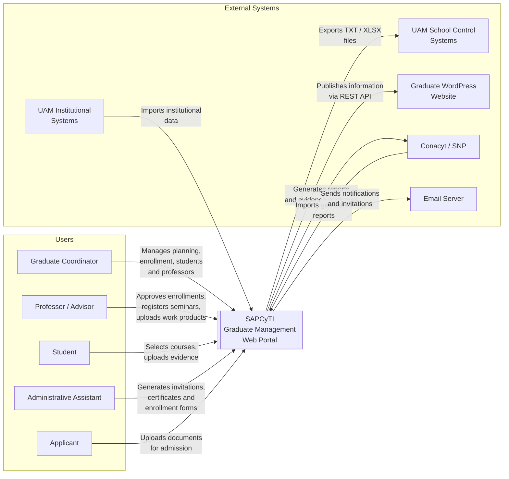

### 3.- Architectural drivers

The architectural drivers were taken from [ArchitecturalDrivers.md](../ArchitecturalDrivers.md). For the MVP, user stories comprising the enrollment flow and entity management are prioritized; Iteration 1 emphasizes constraints and quality attributes with the greatest structural impact (parameterization and multi-graduate program support).

#### User stories (MVP)

| ID | User Story |
| --- | ------------------- |
| **HU-01** | As a system user, I want to log in using a username and password to access the main screen with the options corresponding to my user type. |
| **HU-06** | As a Coordinator, I want to select a term and upload the CSV file for schedules and lotteries to enable enrollment so that students can view available courses. |
| **HU-07** | As a Student, I want to access the enrollment module to select the courses I will take during the term. |
| **HU-08** | As a Professor/Advisor, I want to review the UEAs my students have selected and formally authorize their enrollment. |
| **HU-09** | As a Coordinator or Assistant, I want to generate the enrollment form in PDF for an approved student to formalize the registration with School Systems. |
| **HU-15** | As a Coordinator, I want to register a student with their personal and academic data. |
| **HU-21** | As a Coordinator, I want to register a professor in the system. |

#### Quality attributes

| ID | Quality Attribute | Scenario |
| --- | ------------------- | --------- |
| **QA-1** | Security — Role-based access control | Restrict functions according to user type (Coordinator, Professor, Student, Assistant, Speaker). |
| **QA-2** | Security — CWE Top 25 Protection | Not be vulnerable to SQL injection, XSS, CSRF, etc. |
| **QA-3** | Modifiability — Parameterization | Changes in rules (dates, quotas, criteria) in a single configuration point without modifying code. |
| **QA-4** | Scalability — Multi-graduate program support | Adapt to up to 9 graduate programs with their own rules without structural changes in the core. |
| **QA-5** | Portability — Cloud migration | Facilitate future migration from on-premise → cloud without significant rewriting. |
| **QA-6** | Usability — Internationalization | Present the interface in Spanish and English. |

#### Constraints

| ID | Constraint |
| --- | ----------- |
| **CON-1** | Back-end in **Java**, exclusively **Open Source** libraries. |
| **CON-2** | Initial deployment **on-premise**: Linux, 16 TB storage, 32 GB RAM. |
| **CON-3** | Export to School Systems in **TXT or XLSX** format. |
| **CON-4** | **Asynchronous** integration with the graduate program's **WordPress** website. |
| **CON-5** | Flows with external institutional validation must not force rigid rules; the final decision rests with the graduate commission. |
| **CON-6** | Development by **undergraduate students** with short internships and incremental iterations. |
| **CON-7** | Accessible from **Chrome 130, Safari 22, Firefox 129** and responsive for tablets and phones. |

### 4.- Domain model

The domain model was derived by applying Domain-Driven Design (DDD) based on the primary functional requirements of the MVP (HU-01, HU-06, HU-07, HU-08, HU-09, HU-15, HU-21) and the quality attributes QA-3 (business rule parameterization) and QA-4 (multi-graduate program support). The following DDD building blocks were identified:

  - **Aggregate Root (AR):** Root entity that ensures the transactional consistency of its aggregate. It is the only point of external access to the aggregate.
  - **Entity (E):** Object with its own identity that exists within the boundaries of an aggregate and is managed by its Aggregate Root.
  - **Value Object (VO):** Immutable object without its own identity, defined exclusively by its attributes.

Composition relationships (filled diamond) represent objects that belong to the lifecycle of their aggregate. Directed associations (arrow) represent references between different aggregates.

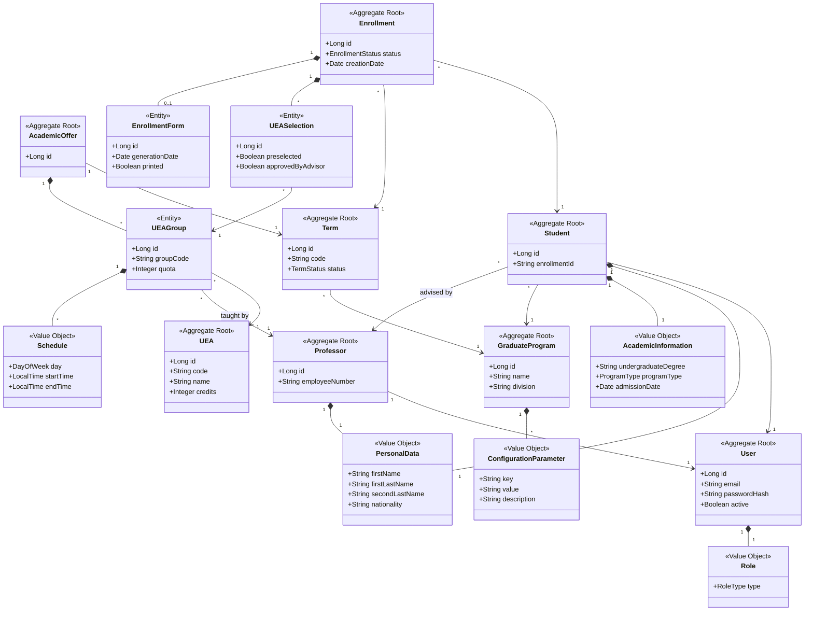

#### Description of domain model elements

| Element | DDD Type | Description |
| :--- | :--- | :--- |
| **GraduateProgram** | Aggregate Root | Represents a UAM graduate program. Contains the parametric configuration of business rules, enabling the multi-graduate program support required by QA-4. |
| **ConfigurationParameter** | Value Object | Immutable key-value pair that externalizes a business rule of the graduate program. Allows modifying dates, quotas, and criteria without changing source code, in response to QA-3. |
| **User** | Aggregate Root | System access account. Stores credentials and activation status. Serves as the authentication identity for all system actors, per HU-01. |
| **Role** | Value Object | User type assigned to an account: COORDINATOR, PROFESSOR, STUDENT, ASSISTANT, or SPEAKER. Determines menu options and visible permissions after login, per QA-1. |
| **Student** | Aggregate Root | Student enrolled in a graduate program. Aggregates personal data and academic information and maintains a reference to their faculty advisor. Derived from HU-15. |
| **PersonalData** | Value Object | Identity data of a person: first name, last names, and nationality. Shared by the Student and Professor aggregates. |
| **AcademicInformation** | Value Object | Data from the student's academic program: original undergraduate degree, graduate program type, and admission date. Derived from HU-15. |
| **Professor** | Aggregate Root | Academic staff member who teaches courses and advises students. Identified by their institutional employee number. Derived from HU-21. |
| **Term** | Aggregate Root | Academic period with an identifying code and a lifecycle with statuses: PLANNING, IN\_ENROLLMENT, IN\_PROGRESS, and COMPLETED. The coordinator activates it by uploading the academic offer, per HU-06. |
| **AcademicOffer** | Aggregate Root | Set of UEA groups offered in a specific term. Created when processing the CSV file of schedules and lotteries uploaded by the coordinator in HU-06. |
| **UEAGroup** | Entity | Specific section of a UEA within the quarterly offer. Defines the group code, available quota, assigned professor, and schedules. It is the unit selectable by students in HU-07. |
| **Schedule** | Value Object | Time block assigned to a group: day of the week, start time, and end time. Derived from information shown to the student in HU-07. |
| **UEA** | Aggregate Root | Teaching-Learning Unit (Unidad de Enseñanza-Aprendizaje) from the academic catalog. Defines the code, name, and credits of a course. It is independent of any particular term or offer. |
| **Enrollment** | Aggregate Root | Process of a student enrolling in a specific term. Manages the complete lifecycle: course selection by the student in HU-07, approval by the advisor in HU-08, and generation of the official form in HU-09. Its statuses are: PENDING\_SELECTION, SELECTION\_COMPLETED, APPROVED\_BY\_ADVISOR, and FORM\_GENERATED. |
| **UEASelection** | Entity | Record of the choice of a specific UEA group within an enrollment. Indicates if it was automatically preselected by the system and if it was approved by the advisor. Derived from HU-07 and HU-08. |
| **EnrollmentForm** | Entity | PDF document generated as a result of the approved enrollment: the "UEA Request" delivered to School Systems. Records the generation date and if it has already been printed. Derived from HU-09. |

### 5.- Container diagram

The system is decomposed into two main containers within the SAPCyTI boundary: the **SPA** (Angular) running in the user's browser, and the **Backend API** (Java 21, Spring Boot) serving the REST API and hosting the business logic. Persistence is handled in **PostgreSQL**. Integrations with WordPress, School Systems, and other external systems are performed by the Backend API.

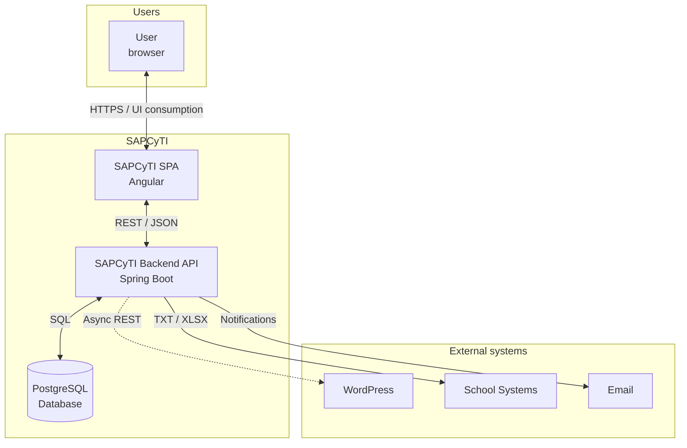

#### Container Responsibilities

| Container | Responsibilities |
| ---------- | ----------------- |
| **SAPCyTI SPA** | Provide the user interface in the browser; routing and views by role; consumption of the REST API; sending tenant context (graduate program) in requests; compatibility with required browsers and responsive designs (CON-7). |
| **SAPCyTI Backend API** | Expose the REST API (JSON); authentication and authorization by roles; multi-tenant context (Graduate Program); business logic and orchestration; reading configuration parameters per graduate program; persistence and data access; generation of TXT/XLSX export; asynchronous integration with WordPress. |
| **PostgreSQL Database** | Store domain data, configuration parameters per graduate program, and multi-tenant data; ensure transactional consistency. |

At runtime, these logical containers are deployed according to the **deployment view** (section 7): the Backend API and database as Docker containers, and the SPA as static assets served by the Nginx container.

### 6.- Component diagrams

#### 6.1.- SAPCyTI Backend API

The Backend API is structured as a **modular monolith**, following **Hexagonal Architecture (Ports & Adapters)** and **DDD principles**. The domain layer sits at the center with zero dependencies on infrastructure. Port interfaces define the contracts through which the domain communicates with external concerns. Infrastructure adapters implement these ports, keeping the domain framework-agnostic and testable in isolation. Each bounded context module follows the same hexagonal structure internally.

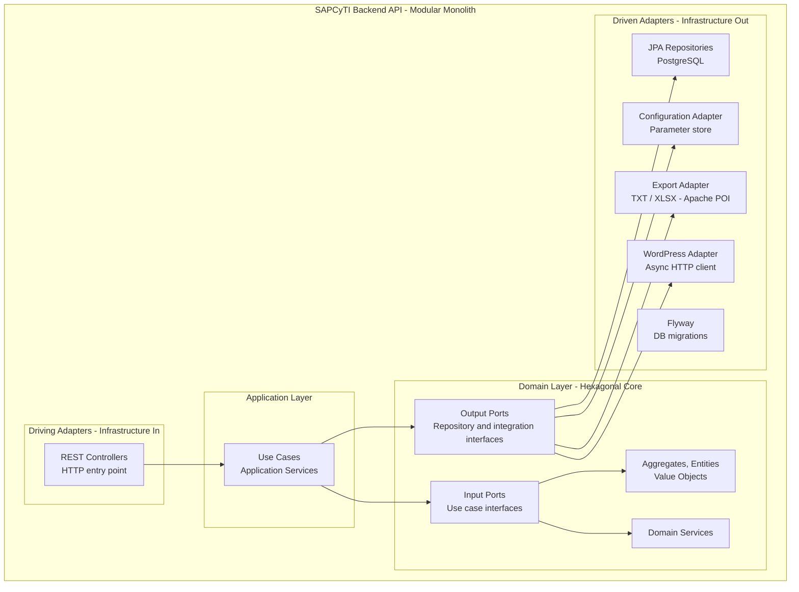

| Component | Responsibilities |
| ---------- | ----------------- |
| **REST Controllers** (Driving Adapter) | Receive HTTP requests; validate input; delegate to use cases via input ports; return JSON responses; apply authentication and tenant context filters. |
| **Use Cases / Application Services** | Orchestrate business operations; coordinate aggregates and domain services through input ports; invoke output ports for persistence, configuration, export, and WordPress integration. |
| **Aggregates, Entities, Value Objects** (Domain) | Core business model as defined in the domain model (§4); business rules; invariant enforcement. Zero dependencies on infrastructure. |
| **Domain Services** (Domain) | Complex business logic spanning multiple aggregates; domain event handling. |
| **Input Ports** (Domain) | Interfaces defining use case contracts. Implemented by the application layer. |
| **Output Ports** (Domain) | Interfaces defining contracts for persistence, configuration, export, and integration. Implemented by driven adapters. |
| **JPA Repositories** (Driven Adapter) | Implement output ports for data access; access PostgreSQL; filtering by tenant (graduate\_program\_id) where applicable. |
| **Configuration Adapter** (Driven Adapter) | Implement output port for reading configuration parameters per Graduate Program; support for QA-3 and QA-4. |
| **Export Adapter** (Driven Adapter) | Implement output port for generating TXT and XLSX files for School Systems (CON-3); uses Apache POI. |
| **WordPress Adapter** (Driven Adapter) | Implement output port for asynchronous HTTP calls to WordPress (CON-4); retries and error handling. |
| **Flyway** (Infrastructure) | SQL-based database schema versioning; migrations run on application startup (Factor XII); scripts in `db/migration/`. |

#### 6.2.- SAPCyTI SPA (Angular)

The SPA is organized into a shell, feature modules, core (auth, HTTP, tenant), and shared components.

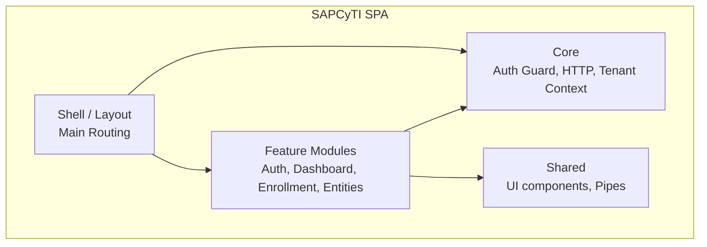

| Component | Responsibilities |
| ---------- | ----------------- |
| **Shell / Layout** | Application structure (menu, bar, container); high-level routing; loading feature modules. |
| **Feature Modules** | Modules by functionality (login, dashboard, enrollment, student/professor management); views and presentation logic per use case. |
| **Core** | Auth guard (route protection by role); HTTP client (interceptors, tenant/graduate program in headers); tenant and user context. |
| **Shared** | Reusable components (tables, forms, messages); pipes; common styles and utilities. |

### 7.- Deployment view

The deployment topology is based on **Docker** and **Docker Compose** on the on-premise Linux server (CON-2). Three environments — **Development (Dev)**, **Pre-production (Pre-prod)**, and **Production (Prod)** — run as **namespaced Compose projects** (`sapcyti-dev`, `sapcyti-preprod`, `sapcyti-prod`) on the same physical host, each with an isolated Docker network and a separate `.env` file. Each environment runs an identical stack of seven services. Runtime configuration is externalized via environment variables, ensuring the same `docker-compose.yml` is used across all environments (Factor X — Dev/prod parity). This topology supports portability to cloud environments (QA-5) and provides a repeatable deployment cycle for the rotating student team (CON-6).

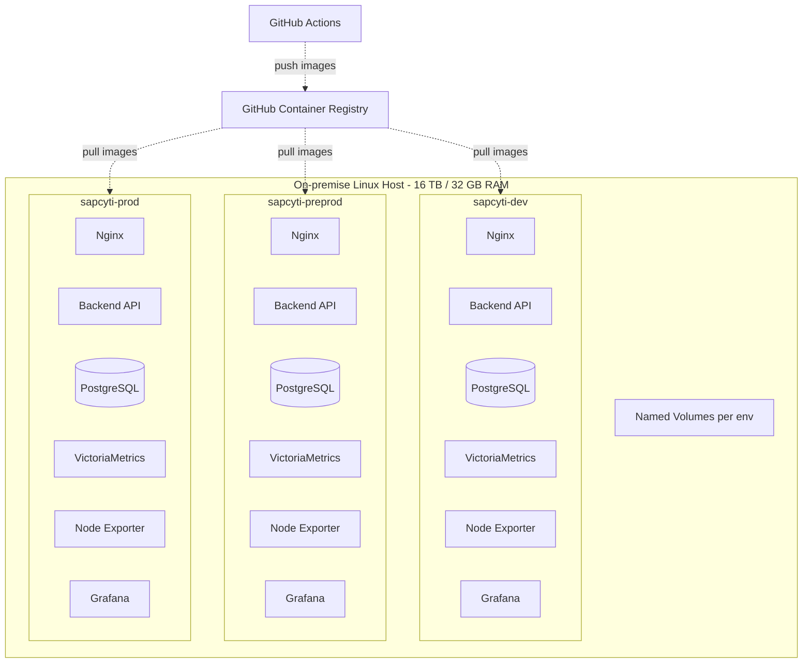

#### Deployment Element Responsibilities

| Element | Responsibilities |
| -------- | ----------------- |
| **Linux Host** | Run Docker Engine and Docker Compose; host all three namespaced Compose projects; house persistent volumes; single point of on-premise deployment. Resource limits (`mem_limit`, `cpus`) set per service to prevent starvation on the shared 32 GB host. |
| **Nginx Container** | Act as reverse proxy (unique port per environment); route `/api` to the Backend API; serve SPA static assets; optionally terminate TLS. |
| **Backend API Container** | Run the Spring Boot application (stateless process, Factor VI); connect to PostgreSQL and external services; read configuration from environment variables (Factor III); expose `/actuator/health` for Docker `HEALTHCHECK` and `/actuator/prometheus` for metrics scraping; Flyway runs DB migrations on startup (Factor XII). Embedded Tomcat exports service via port binding (Factor VII). Graceful shutdown enabled (Factor IX). |
| **PostgreSQL Container** | Provide the database; persist data in an environment-specific named volume. |
| **VictoriaMetrics Container** | Single-node metrics storage; scrapes Node Exporter and Backend API Actuator `/actuator/prometheus` endpoint; evaluates alert rules; sends notifications via SMTP. Prometheus-compatible API. |
| **Node Exporter Container** | Expose host-level metrics (disk, CPU, RAM) for VictoriaMetrics scraping (C004.2.2). |
| **Grafana Container** | OSS dashboards for host health, JVM metrics, HTTP request rates, and Docker container resource usage. Data source: VictoriaMetrics. |
| **Named Volumes** | Persist PostgreSQL data and VictoriaMetrics time-series data between container restarts, per environment. |
| **Docker Compose** | Define services, networks, and volumes; the `-p` flag creates namespaced projects (`sapcyti-dev`, `sapcyti-preprod`, `sapcyti-prod`) with isolated networks on the same host. |
| **Environment files** | `.env.dev`, `.env.preprod`, `.env.prod` — contain all environment-specific configuration (DB credentials, API URLs, feature flags). No secrets in code (Factor III). |

### 8.- CI/CD (Build and release)

The system uses **two separate GitHub repositories** (`sapcyti-api` for the Backend API and `sapcyti-spa` for the SPA), each with **two GitHub Actions workflows**: a **PR Validation** workflow that runs on pull requests (lint, build, test, scan — no image build), and a **Merge & Deploy** workflow that runs on merges to `develop`, `release/*`, or `main` (full pipeline including Docker image build, push to GHCR, and deployment). This separation avoids building and publishing images for code that hasn't been reviewed and approved yet. The pipelines enforce quality gates including a minimum **80% unit test code coverage** threshold, automated security scanning, and required reviewer approval before any merge.

#### 8.1.- Backend API — PR Validation Workflow (`sapcyti-api`)

Triggered on **PR to `develop`**. Validates code quality without building or publishing a Docker image.

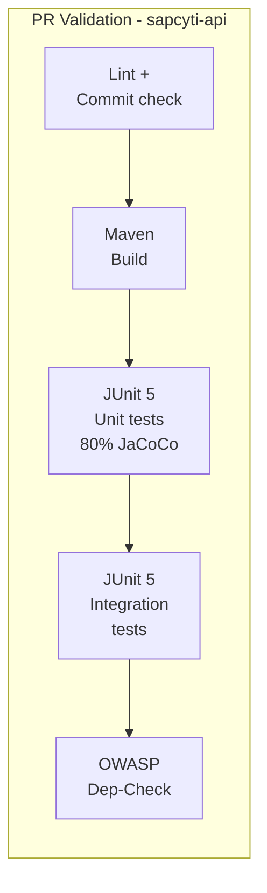

#### 8.2.- Backend API — Merge & Deploy Workflow (`sapcyti-api`)

Triggered on **push (merge) to `develop`, `release/*`, `main`**. Runs the full pipeline including image build, publish, and deployment.

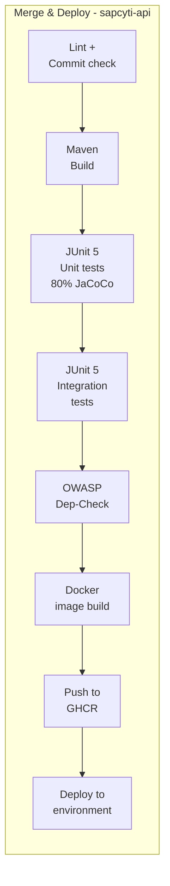

#### 8.3.- SPA — PR Validation Workflow (`sapcyti-spa`)

Triggered on **PR to `develop`**. Validates code quality without building or publishing a Docker image.

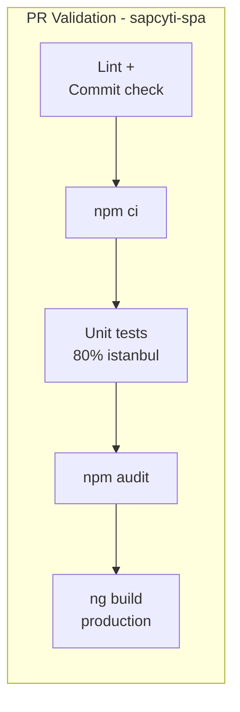

#### 8.4.- SPA — Merge & Deploy Workflow (`sapcyti-spa`)

Triggered on **push (merge) to `develop`, `release/*`, `main`**. Runs the full pipeline including image build, publish, and deployment.

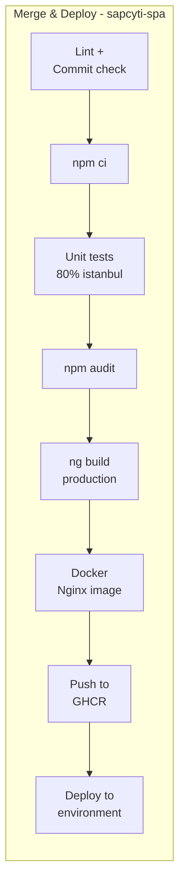

#### 8.5.- Deployment Promotion Flow

All three environments run on the same physical server as namespaced Compose projects. Manual approval is required at **every stage**, including merges to `develop`. All changes on a PR to `develop` must be locally tested with passing unit tests before submission.

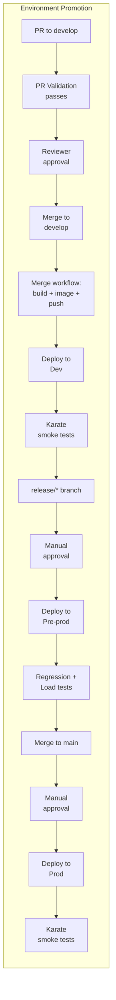

#### Pipeline Stage Responsibilities

| Stage | Workflow | Repository | Responsibilities |
| ----- | -------- | ---------- | ----------------- |
| **Lint + Commit check** | PR Validation + Merge & Deploy | Both | Validate code style (ESLint / Checkstyle) and enforce Conventional Commits format via `commitlint`. |
| **Build** | PR Validation + Merge & Deploy | API: Maven/Gradle, SPA: `npm ci` + `ng build` | Compile the application; produce build artifacts. |
| **Unit tests** | PR Validation + Merge & Deploy | API: JUnit 5 + JaCoCo, SPA: Karma + istanbul | Run unit tests; enforce **minimum 80% code coverage**; fail pipeline if threshold not met. |
| **Integration tests** | PR Validation + Merge & Deploy | API: JUnit 5 | Run integration tests against embedded database or testcontainers. |
| **Security scanning** | PR Validation + Merge & Deploy | API: OWASP Dependency-Check, SPA: `npm audit` | Scan transitive dependencies for known CVEs; fail on critical vulnerabilities (C010.2.2). |
| **Docker image build** | Merge & Deploy only | Both | Build multi-stage Docker image; tag with Git SHA + branch. Only runs after merge, not on PRs. |
| **Push to GHCR** | Merge & Deploy only | Both | Push image to GitHub Container Registry; authentication via `GITHUB_TOKEN`. Only runs after merge. |
| **Deploy** | Merge & Deploy only | Both (deployment job) | SSH to host → `docker compose -p sapcyti-{env} --env-file .env.{env} pull` → `docker compose -p sapcyti-{env} --env-file .env.{env} up -d` → health check via `curl /actuator/health`. |
| **Smoke tests** | Merge & Deploy only | Both (post-deploy) | Run Karate automated smoke tests (API + UI) against the deployed environment. |
| **Regression + Load tests** | Merge & Deploy only | Pre-prod only | Run Karate regression suite + Gatling load tests (50+ concurrent users) before production promotion. |

### 9.- Sequence diagrams

#### 9.1.- Request flow with tenant context and parameter resolution

This diagram illustrates how elements instantiated in Iteration 1 collaborate when a user performs an action in the SPA: the request includes the tenant context (graduate program), the Backend resolves configuration parameters for that program, and executes business logic against the database.

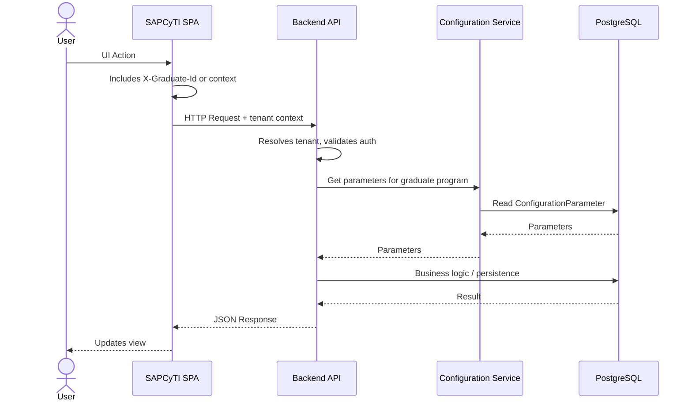

**Description:** The user interacts with the SPA (Angular). The SPA sends each request to the Backend API with the active graduate program identifier (header or path). The API validates the session and tenant, consults the configuration parameters associated with that graduate program via the Configuration Service, and executes the business logic on the database. The response is returned in JSON, and the SPA updates the interface. This flow supports QA-3 (single-point parameterization) and QA-4 (multi-tenancy per graduate program).

#### 9.2.- Deployment promotion cycle

This diagram illustrates the collaboration of DevOps elements instantiated in Iteration 2: the full lifecycle from PR creation through multi-environment deployment with quality gates, manual approvals, and automated testing at each stage.

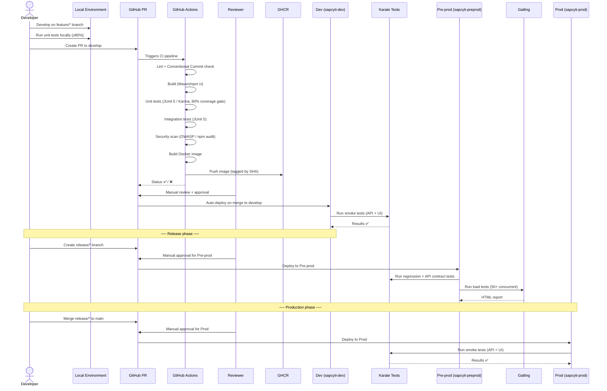

**Description:** The developer works on a `feature/*` branch, running unit tests locally to ensure ≥80% coverage before creating a PR to `develop`. GitHub Actions runs the full CI pipeline (lint, build, tests, security scan, image build); the pipeline fails if coverage drops below 80% or critical CVEs are found. A reviewer must manually approve the PR before merge. On merge to `develop`, the new image is auto-deployed to the Dev environment, followed by Karate smoke tests. For production promotion, a `release/*` branch is created, manually approved for Pre-prod, where regression tests (Karate) and load tests (Gatling) validate the release. Finally, merging to `main` with manual approval deploys to Production, with post-deploy smoke tests.

#### 9.3.- Monitoring and alerting flow

This diagram illustrates the observability stack instantiated in Iteration 2: the Backend API and host export metrics, VictoriaMetrics collects and evaluates alert rules, Grafana provides dashboards, and alerts are sent via SMTP.

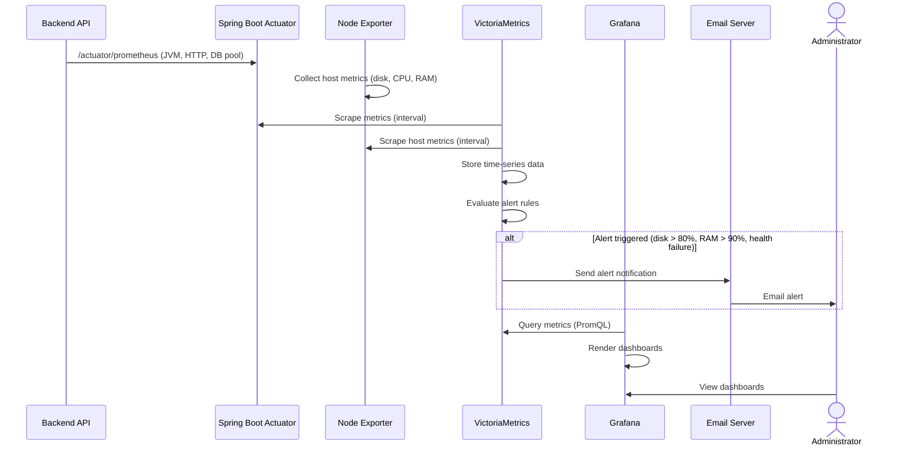

**Description:** The Backend API exposes JVM, HTTP, and database pool metrics via Spring Boot Actuator in Prometheus format. Node Exporter collects host-level metrics (disk, CPU, RAM). VictoriaMetrics scrapes both sources at regular intervals, stores the time-series data, and evaluates alert rules. When thresholds are breached (disk > 80%, memory > 90%, or service health failure), VictoriaMetrics sends notifications via the existing SMTP integration. Grafana queries VictoriaMetrics using PromQL and renders dashboards for the team and administrators.

### 10.- Interfaces

#### Application interfaces

  - **Backend API:** REST API over HTTPS. Content in JSON for both request and response. Authentication will be defined in Iteration 3 (security). The tenant context (active graduate program) is sent in every request, either in a header (e.g., `X-Graduate-Id`) or in the path depending on the resource.
  - **Main API Areas** (details in later iterations): authentication; graduate programs and tenant selection; configuration and parameters; enrollment and academic offer; student and professor management; export (TXT/XLSX). Concrete contracts (OpenAPI or equivalent) will be documented as endpoints are defined per iteration.

#### Observability interfaces

  - **Health check endpoint:** `/actuator/health` — used by Docker `HEALTHCHECK` directive and the deployment job's post-deploy verification (`curl /actuator/health`). Returns liveness and readiness status. Exposed on the internal Compose network.
  - **Metrics endpoint:** `/actuator/prometheus` — exports JVM, HTTP request, and database connection pool metrics in Prometheus exposition format. Scraped by VictoriaMetrics at a configurable interval. Exposed on the internal Compose network only (not publicly accessible).
  - **Build info endpoint:** `/actuator/info` — returns build version and Git SHA for deployment traceability (C005.1.3).

#### DevOps and operational interfaces

  - **Pipeline ↔ Image Registry:** GitHub Actions uploads Docker images (Backend API and SPA/Nginx) to GitHub Container Registry (ghcr.io) via OCI push, tagged by Git SHA and branch. Authentication via `GITHUB_TOKEN` in the pipeline; PAT/credentials on the server for pull.
  - **Pipeline ↔ Server (deploy):** The deployment job connects to the target server via SSH, executes `docker compose -p sapcyti-{env} --env-file .env.{env} pull` followed by `docker compose -p sapcyti-{env} --env-file .env.{env} up -d`, then verifies health via `curl /actuator/health`. The `-p` flag targets the correct namespaced Compose project.
  - **Inter-environment promotion:** Images flow from GHCR to Dev (auto on `develop` merge) → Pre-prod (manual approval on `release/*`) → Prod (manual approval on `main` merge). All environments pull the same immutable image from GHCR — no re-building between environments.
  - **VictoriaMetrics ↔ Targets:** VictoriaMetrics scrapes Node Exporter (`:9100/metrics`) and Backend API Actuator (`:8080/actuator/prometheus`) on the internal Compose network. Prometheus-compatible scrape configuration.
  - **VictoriaMetrics ↔ Grafana:** Grafana uses VictoriaMetrics as a Prometheus-compatible data source for dashboards and PromQL queries.

#### Runtime container interfaces

  - **Nginx ↔ Backend API:** Nginx proxies `/api` requests to the Backend API via HTTP on the internal Compose network (e.g., `http://api:8080`).
  - **Backend API ↔ PostgreSQL:** JDBC connection via TCP on the internal Compose network; connection string and credentials from environment variables (Factor III).
  - **VictoriaMetrics ↔ SMTP:** Alert notifications sent via the existing email server when alert rules trigger.

### 11.- Design decisions

Design decisions from **Iteration 1** (general system structure), associated with the addressed drivers.

| Driver | Decision | Rationale | Discarded Alternatives |
| ------ | -------- | --------- | ------------------------- |
| **CON-1** | Back-end in **Java 21** with **Spring Boot 3.x** and Open Source libraries. | Meets Java and OSS constraints; Java 21 is LTS and offers good long-term support; mature ecosystem and documentation facilitate student rotation (CON-6). | Jakarta EE (heavier), Quarkus/Micronaut (lower adoption for learning). |
| **CON-2** | **On-premise** deployment on a single Linux server with a **reverse proxy** (e.g., Nginx) in front of the application. | A single host and single application process simplify operation and debugging for the team (CON-6). | Kubernetes or orchestration in Iteration 1 (unnecessary for one server). |
| **CON-3** | **Export Adapter** module generating **TXT and XLSX** files (Apache POI) for School Systems. | Encapsulates the format required by School Control as a driven adapter implementing an output port; maintains OSS libraries. | CSV only (does not meet CON-3); proprietary libraries (violate CON-1). |
| **CON-4** | Integration with WordPress via **asynchronous HTTP client** (WebClient/Async) or scheduled jobs from the Backend API. | Avoids UI blocking and double entry; does not introduce a message broker in this iteration. | Synchronous integration (couples availability to WordPress). |
| **CON-5** | Validation rules depending on external systems are **parameterizable**; the graduate commission has the final decision. | Validations are not hardened in code; supported through configuration and operational criteria. | Rigid code validations imposing fixed institutional rules. |
| **CON-6** | **Modular Monolith** following Hexagonal Architecture and DDD principles; modules by bounded context; **Angular** for the SPA; predictable documentation and structure. | A single deployment and known stack reduce the cognitive load for rotating developers. Domain is framework-agnostic and testable in isolation. | Microservices (too much operational complexity); Layered architecture (tight coupling, domain depends on persistence); SPA with poorly documented stack. |
| **CON-7** | **Angular SPA** with support for specified browsers and **responsive** design (CSS, viewport). | Angular has broad support and standard practices for compatibility and responsiveness. | Thymeleaf only (user preference for SPA); SPA without framework (greater maintenance effort). |
| **QA-3** | **Externalized configuration**: parameters per Graduate Program in the database (parameter table/s); Configuration Adapter exposes them at runtime via an output port. | Single point of configuration; changes without code deployment; aligned with the domain model (ConfigurationParameter). | Fixed values in code; configuration files only (no support per graduate program). |
| **QA-4** | **Multi-tenant by discriminator**: same database and schema, **graduate\_program\_id** in tenant-scoped tables; tenant context in every request. | Supports up to 9 graduate programs without multiple databases or schemas; simple operation aligned with the GraduateProgram aggregate. | Database per tenant (excessive); schema per tenant (higher operational complexity). |

Design decisions from **Iteration 2** (DevOps infrastructure and deployment), associated with the addressed drivers.

| Driver | Decision | Rationale | Discarded Alternatives |
| ------ | -------- | --------- | ------------------------- |
| **QA-5** | Backend API and PostgreSQL run as **Docker containers**; runtime configuration via **environment variables** (Spring Boot profiles + `.env` files); topology defined in a single **Docker Compose** file used identically across three environments (Factor X). Nginx in a container serves SPA static assets. | Same image and topology in any environment; decoupling from specific infrastructure; facilitates future cloud migration. | Bare metal deployment only (less portable); exclusive cloud orchestration. |
| **CON-2** | **Docker Compose** on the single Linux server runs three **namespaced Compose projects** (`sapcyti-dev`, `sapcyti-preprod`, `sapcyti-prod`), each with the same 7-service stack (Nginx, Backend API, PostgreSQL, VictoriaMetrics, Node Exporter, Grafana, shared network). No Kubernetes. | Respects the single-server constraint; isolated environments via `-p` namespacing; the same stack can be reproduced in development. | Kubernetes; multi-node orchestration; separate servers (budget constraint). |
| **CON-6** | **Two independent GitHub Actions CI/CD pipelines** (one per repository: `sapcyti-api`, `sapcyti-spa`); **GitFlow** branching model; **Conventional Commits** enforced via `commitlint` + `husky`; **PR-based quality gates** with required status checks and reviewer approval at every stage. | Repeatable build–test–deploy cycle; independent release cadences; reduces dependency on a single person; compatible with GitHub and on-premise server; structured process ideal for rotating students. | Jenkins (more maintenance); trunk-based development (too risky for junior developers); GitHub Flow (too simple for three environments); single monorepo pipeline (contradicts two-repo decision). |
| **CON-6, C005.1.2, C010.2.1** | **Minimum 80% unit test code coverage** enforced in CI via **JaCoCo** (API) and **istanbul** (SPA); pipeline fails if threshold not met. All PR changes must be **locally tested** before submission. **Manual reviewer approval** required before merge to `develop`. | Ensures code quality even with rotating student developers; prevents untested code from entering shared environments. | No coverage threshold (risk of untested code); post-merge testing only (catches issues too late). |
| **C004.1.1, Factor IX, XII** | **Hexagonal Architecture (Ports & Adapters)** for the Backend API internal structure within the modular monolith. Domain layer has zero infrastructure dependencies. **Flyway** for SQL-based DB schema versioning on startup. | Enforces DDD boundaries; domain testable in isolation (mock adapters); backing services swappable via adapter replacement (Factor IV). Flyway provides version-controlled, reproducible migrations (Factor XII). | Clean Architecture (more boilerplate, overkill for project scale); Traditional layered (tight coupling); Liquibase (more complex); manual DDL scripts (no versioning). |
| **C004.2.2, C004.2.3** | **VictoriaMetrics** (single-node, community edition) + **Node Exporter** + **Grafana** for monitoring; **Spring Boot Actuator** for health checks and metrics (`/actuator/health`, `/actuator/prometheus`, `/actuator/info`); alert rules for disk > 80%, RAM > 90%, health failures → SMTP notification. | Lower resource consumption than Prometheus (~7x less RAM) on the shared 32 GB host; Prometheus-compatible API ensures no lock-in; Grafana provides visual dashboards. | Prometheus (higher resource footprint, would require earlier vertical scaling); commercial monitoring (budget constraint); no monitoring (blind operation). |
| **C004.2.3, Factor XI** | **Structured JSON logging** to stdout via SLF4J + Logback with `logstash-logback-encoder`. Dev profile uses plain-text console output. Log fields include timestamp, level, logger, thread, message, MDC context (graduate\_program\_id, user\_id, request\_id). | Logs as event streams (Factor XI); machine-parseable for future aggregation; Docker log driver captures stdout natively; MDC context enables filtering by tenant for multi-program debugging. | File-based logging (violates Factor XI); plain text logging (not machine-parseable). |
| **C010.1.x, C010.2.x** | Comprehensive test strategy: **JUnit 5** for unit and integration tests; **Karate** framework for automated smoke, regression, and API contract tests (API + UI); **Gatling** for load/performance testing (50+ concurrent users); **Postman** for manual API testing. Sanitized test data via **Flyway** test migrations. | All automated tools are JVM-based (consistent with Java stack and Maven/Gradle integration). Karate provides unified BDD framework for API and UI testing. Gatling produces HTML reports. Postman gives GUI for manual API exploration. | k6 (JavaScript, less natural for Java team); JMeter (XML config, clunky GUI); unit tests only (insufficient coverage). |
| **C010.2.2** | **OWASP Dependency-Check** (backend) + **npm audit** (SPA) in CI pipeline; fail on critical CVEs. | Automated security scanning catches known vulnerabilities before merge; OSS; integrates with GitHub Actions. | Snyk (commercial for advanced features); no scanning (unacceptable security risk). |
| **C005.1.5, Factor X** | **Three-environment deployment** (Dev, Pre-prod, Prod) with **identical topology** differentiated only by `.env` files. Manual approval at every promotion stage including `develop`. | True dev/prod parity; Pre-prod serves as full QA gate before production; prevents untested code from reaching any shared environment. | Two environments (no QA gate); four+ environments (over-engineering). |

### 12.- Development workflow

This section documents the development practices, branching model, and quality policies that govern how code flows through the SAPCyTI system. It serves as the primary reference for rotating student developers.

#### 12.1.- GitFlow branching model

Both repositories (`sapcyti-api` and `sapcyti-spa`) follow the **GitFlow** branching model:

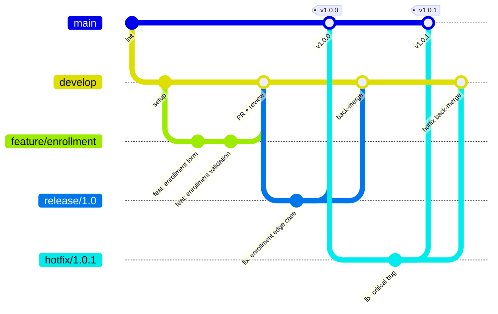

| Branch | Purpose | Deploys to |
| ------ | ------- | ---------- |
| `main` | Production-ready code. Only receives merges from `release/*` and `hotfix/*`. | Prod (manual approval) |
| `develop` | Integration branch for the next release. Receives merges from `feature/*`. | Dev (auto after merge) |
| `feature/*` | Individual feature or fix development. Created from `develop`. | — (local/CI only) |
| `release/*` | Release preparation and stabilization. Created from `develop`. | Pre-prod (manual approval) |
| `hotfix/*` | Urgent production fixes. Created from `main`, merged back to `main` and `develop`. | Prod (manual approval) |

#### 12.2.- Conventional Commits

All commits must follow the [Conventional Commits](https://www.conventionalcommits.org/) specification, enforced via `commitlint` + `husky` pre-commit hooks.

**Format:** `<type>(<scope>): <description>`

| Type | Purpose | Example |
| ---- | ------- | ------- |
| `feat` | New feature | `feat(enrollment): add PDF generation` |
| `fix` | Bug fix | `fix(auth): correct session timeout handling` |
| `docs` | Documentation only | `docs(readme): update setup instructions` |
| `style` | Formatting, no logic change | `style(api): apply Checkstyle rules` |
| `refactor` | Code refactoring | `refactor(domain): extract enrollment service` |
| `test` | Adding or modifying tests | `test(enrollment): add JUnit integration test` |
| `chore` | Build, config, tooling | `chore(ci): add OWASP Dependency-Check stage` |

#### 12.3.- PR/Code review process

1. **Developer** creates a `feature/*` branch from `develop`.
2. Developer runs unit tests locally and ensures ≥80% coverage before submitting.
3. Developer creates a **Pull Request** to `develop` on GitHub.
4. **GitHub Actions CI pipeline** runs automatically (lint, build, tests, security scan, coverage gate).
5. If CI passes, a **reviewer** (senior student, academic supervisor, or coordinator) performs a code review.
6. Reviewer **approves** or requests changes.
7. On approval, the PR is **merged** to `develop`, triggering auto-deployment to Dev.

**GitHub branch protection rules** on `develop` and `main`:
- Require CI status checks to pass
- Require at least 1 approving review
- Require up-to-date branches before merging
- No direct pushes (all changes via PR)

#### 12.4.- Unit test coverage policy

All code changes must maintain a **minimum 80% unit test code coverage**. This is enforced automatically in the CI pipeline:

- **Backend API:** JaCoCo coverage report; pipeline fails if line coverage < 80%.
- **SPA:** istanbul/nyc coverage report via Karma; pipeline fails if statement coverage < 80%.

Coverage reports are generated as pipeline artifacts and available for review.

#### 12.5.- Technical debt tracking

A `TECH_DEBT.md` file is maintained in each repository's root directory, serving as a technical debt register:

| Column | Description |
| ------ | ----------- |
| **ID** | Unique identifier (e.g., `TD-001`) |
| **Description** | What the tech debt is |
| **Priority** | High / Medium / Low |
| **Rationale** | Why it was incurred |
| **Impact** | What happens if not addressed |
| **Target iteration** | When it should be resolved |

### 13.- Test infrastructure

This section documents the comprehensive test strategy across the three deployment environments, the tooling used at each level of the test pyramid, and the approach to test data management.

#### 13.1.- Test pyramid and tooling

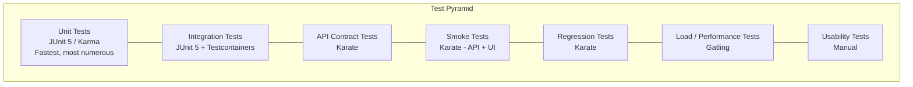

#### 13.2.- Test type / environment matrix

| Test Type | Tool | Dev | Pre-prod | Prod | Automated/Manual |
| --------- | ---- | --- | -------- | ---- | ---------------- |
| **Unit tests** | JUnit 5 (API), Karma (SPA) | ✅ CI gate (80% coverage) | — | — | Automated |
| **Integration tests** | JUnit 5 + Testcontainers | ✅ CI gate | — | — | Automated |
| **Smoke tests** | Karate (API + UI) | ✅ Post-deploy | ✅ Post-deploy | ✅ Post-deploy | Automated |
| **Regression tests** | Karate (API + UI) | — | ✅ Before promotion | — | Automated |
| **API contract tests** | Karate | — | ✅ Before promotion | — | Automated |
| **Load / Performance tests** | Gatling | — | ✅ Before promotion | — | Automated |
| **Usability tests** | Manual (coordinated with stakeholders) | — | ✅ Scheduled | — | Manual |
| **Manual API testing** | Postman | ✅ Ad-hoc | ✅ Ad-hoc | — | Manual |

#### 13.3.- Tooling details

| Tool | Purpose | Integration | Reports |
| ---- | ------- | ----------- | ------- |
| **JUnit 5** | Unit and integration tests for Backend API | Maven/Gradle Surefire/Failsafe plugins; runs in CI pipeline | JaCoCo HTML/XML coverage reports |
| **Karma + istanbul** | Unit tests for SPA | Angular CLI (`ng test`); runs in CI pipeline | istanbul/nyc HTML coverage reports |
| **Karate** | BDD-style automated API and UI tests (smoke, regression, API contract) | Maven/Gradle plugin; runs as post-deploy job in CI/CD | Cucumber HTML reports |
| **Gatling** | Load and performance testing | Maven/Gradle plugin; simulates 50+ concurrent users (enrollment peak per C004.2.1) | HTML reports with response time distributions |
| **Postman** | Manual API exploration and ad-hoc validation | Standalone GUI application; shared collections in repository | JSON collections exportable to HTML |

#### 13.4.- Sanitized test data

Test data for Dev and Pre-prod environments is managed through **Flyway test migrations**:

- Test migration scripts are stored in `src/test/resources/db/testdata/` following the naming convention `V{version}__test_{description}.sql`.
- Test data is **sanitized** — no real student, applicant, or professor personal information is used.
- Test data seeds are applied automatically when Flyway runs in Dev and Pre-prod profiles.
- Production uses only production Flyway migrations (`src/main/resources/db/migration/`); test data scripts are never executed in Prod.

### 14.- Observability and monitoring

This section documents the monitoring, logging, and alerting architecture that supports operational health visibility across all three environments.

#### 14.1.- Monitoring stack architecture

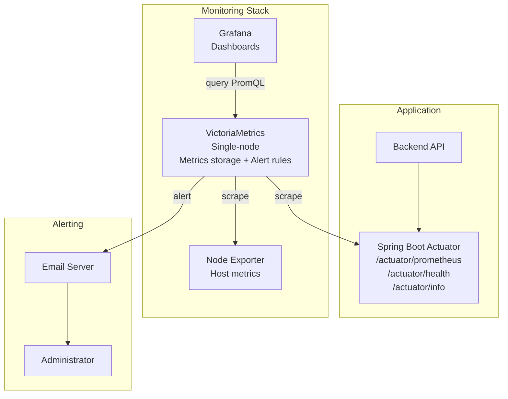

#### 14.2.- Structured JSON logging

The Backend API writes logs as **event streams to stdout** (Factor XI), captured by the Docker log driver:

| Profile | Format | Encoder |
| ------- | ------ | ------- |
| **dev** | Plain-text console | Logback `PatternLayout` |
| **preprod, prod** | Structured JSON | `logstash-logback-encoder` |

**Standard log fields:**
- `timestamp` — ISO-8601
- `level` — DEBUG, INFO, WARN, ERROR
- `logger` — class name
- `thread` — thread name
- `message` — log message
- `graduate_program_id` — MDC tenant context
- `user_id` — MDC authenticated user
- `request_id` — MDC correlation ID for request tracing

#### 14.3.- Alert rules

| Metric | Threshold | Action |
| ------ | --------- | ------ |
| Host disk usage | > 80% | Email notification to administrator |
| Host memory usage | > 90% | Email notification to administrator |
| Backend API health check | Failure (unhealthy) | Email notification to administrator |
| Container restart count | > 3 in 5 minutes | Email notification to administrator |
| HTTP 5xx error rate | > 5% over 5 minutes | Email notification to administrator |

Alert rules are configured in VictoriaMetrics' alerting configuration and notifications are sent via the existing SMTP integration.

#### 14.4.- Observability element responsibilities

| Element | Responsibilities |
| ------- | ----------------- |
| **Spring Boot Actuator** | Expose health checks (liveness + readiness), build info (version, Git SHA), and JVM/HTTP/DB pool metrics in Prometheus format. |
| **Node Exporter** | Collect and expose host-level metrics: disk utilization, CPU usage, memory usage, network I/O. |
| **VictoriaMetrics** | Scrape, store, and query metrics; evaluate alert rules; send alert notifications via SMTP. Lower resource footprint than Prometheus (~7x less RAM). |
| **Grafana** | Render dashboards for the team; provide visual monitoring of system health, performance trends, and resource consumption. |
| **SMTP integration** | Deliver alert email notifications to the system administrator and/or coordinator. |
