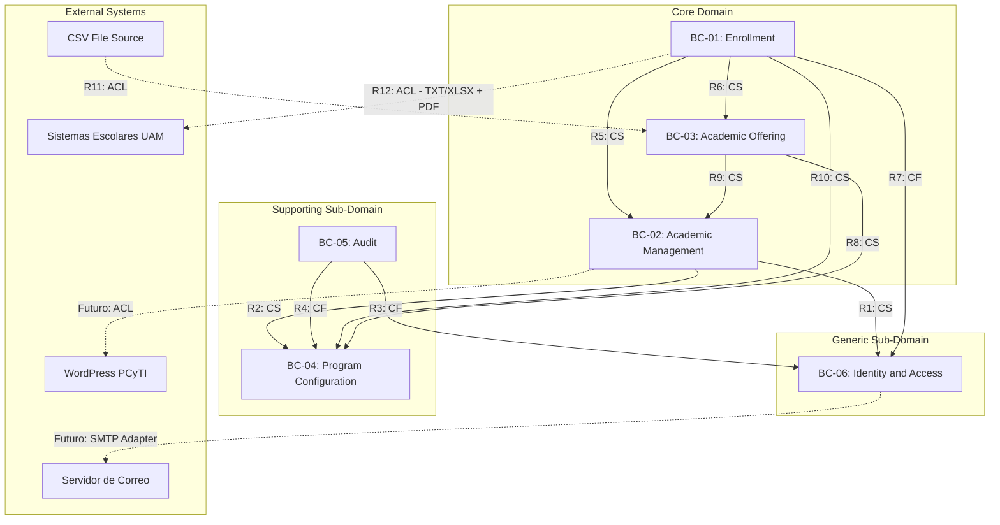
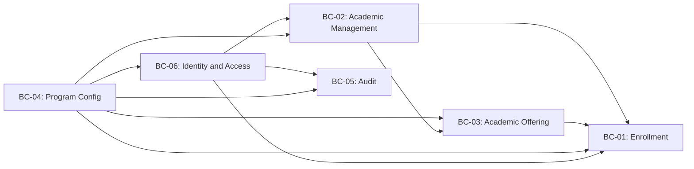
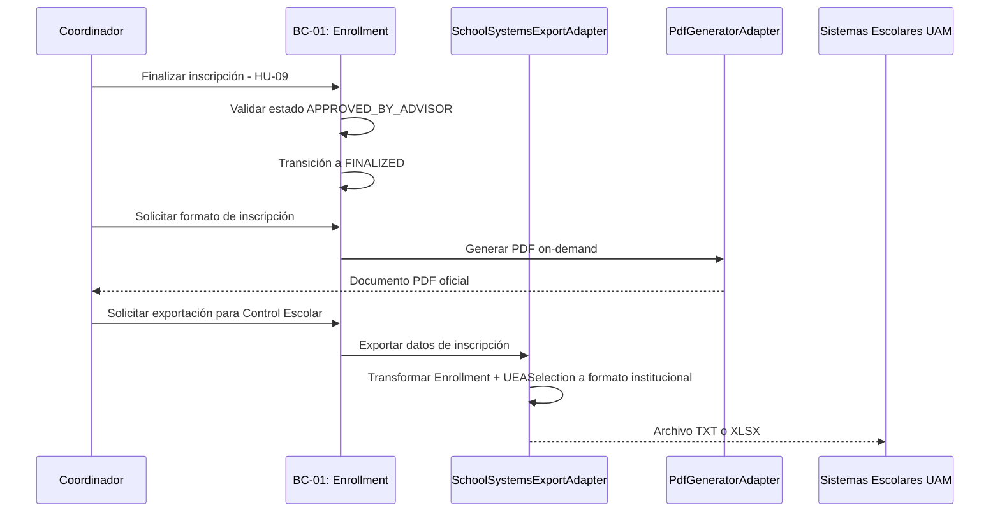

# Context Map — SAPCyTI

> **Propósito**: Este documento define los Bounded Contexts del sistema SAPCyTI, sus relaciones estratégicas (DDD), los elementos compartidos (Shared Kernel), y los puntos de integración con sistemas externos. Está diseñado para ser consumido sin ambigüedad por agentes de IA y equipos de desarrollo.
>
> **Fuentes**: [ArchitecturalDrivers.md](../ArchitecturalDrivers.md), [Architecture.md](../Design/Architecture.md), [Atributos_y_Restricciones.md](../Analisis_Requerimientos/Atributos_y_Restricciones.md), [Concerns.md](../Analisis_Requerimientos/Concerns.md)

---

## 1. Bounded Contexts

El sistema se organiza en **6 Bounded Contexts** agrupados por clasificación de sub-dominio DDD. Cada contexto tiene una responsabilidad única, un vocabulario propio (Ubiquitous Language), y fronteras explícitas. Las referencias entre contextos se realizan exclusivamente por **ID** (nunca por referencia directa de objeto).

### 1.1 Core Domain — Lógica de negocio diferenciadora

Estos contextos contienen las reglas de negocio más complejas y específicas del posgrado PCyTI. Requieren la mayor inversión en diseño y calidad.

#### BC-01: Enrollment (Inscripción)

| Propiedad | Valor |
| :--- | :--- |
| **Sub-Dominio** | Core |
| **Aggregates** | `Enrollment` (AR), `UEASelection` (Entity) |
| **Responsabilidad** | Ciclo de vida completo de la inscripción: selección de materias por el alumno (HU-07), aprobación/rechazo por asesor (HU-08), finalización por coordinador (HU-09). Generación on-demand de formato PDF. Exportación TXT/XLSX hacia Sistemas Escolares (CON-3). |
| **Máquina de estados** | `PENDING_SELECTION` → `SELECTION_COMPLETED` → `APPROVED_BY_ADVISOR` → `FINALIZED` |
| **Drivers satisfechos** | HU-07, HU-08, HU-09, CON-3, CON-5 |
| **Complejidad** | Muy alta — proceso multi-actor con máquina de estados y validaciones cruzadas contra oferta académica y reglas del programa |

#### BC-02: Academic Management (Gestión Académica)

| Propiedad | Valor |
| :--- | :--- |
| **Sub-Dominio** | Core |
| **Aggregates** | `Student` (AR), `Professor` (AR), `PersonalData` (VO), `AcademicInformation` (VO) |
| **Responsabilidad** | CRUD de entidades académicas core: alumnos (HU-15) y profesores (HU-21). Gestión de datos personales. Asignación de asesor. Coordinación con Identity & Access para creación de credenciales. |
| **Drivers satisfechos** | HU-15, HU-21 |
| **Complejidad** | Media — lógica de registro con generación automática de contraseña y vinculación a usuario |

#### BC-03: Academic Offering (Oferta Académica)

| Propiedad | Valor |
| :--- | :--- |
| **Sub-Dominio** | Core |
| **Aggregates** | `Term` (AR), `AcademicOffer` (AR), `UEAGroup` (Entity), `UEA` (AR), `Schedule` (VO) |
| **Responsabilidad** | Gestión del periodo académico (trimestre) con máquina de estados. Importación de oferta vía CSV (HU-06) mediante Anti-Corruption Layer. Catálogo de UEAs. Administración de cupos y horarios por grupo. |
| **Máquina de estados** | `PLANNING` → `OFFER_LOADED` → `IN_ENROLLMENT` → `IN_PROGRESS` → `COMPLETED` |
| **Drivers satisfechos** | HU-06 |
| **Complejidad** | Alta — importación CSV con ACL, máquina de estados del trimestre, gestión de cupos |

### 1.2 Supporting Sub-Domain — Soporte habilitante

Habilitan los contextos Core pero no representan lógica diferenciadora del negocio. Se construyen a medida pero con menor complejidad.

#### BC-04: Program Configuration (Configuración del Programa)

| Propiedad | Valor |
| :--- | :--- |
| **Sub-Dominio** | Supporting |
| **Aggregates** | `GraduateProgram` (AR), `ConfigurationParameter` (VO) |
| **Responsabilidad** | Contexto multi-tenant. Parametrización de reglas de negocio por programa de posgrado (QA-3). Soporte para hasta 9 posgrados divisionales (QA-4). Punto único de configuración para fechas, cupos, criterios de evaluación. |
| **Drivers satisfechos** | QA-3, QA-4 |
| **Complejidad** | Baja-Media — CRUD de configuración con modelo clave-valor |

#### BC-05: Audit (Auditoría)

| Propiedad | Valor |
| :--- | :--- |
| **Sub-Dominio** | Supporting |
| **Aggregates** | `AuditEvent` (AR), `AuditSeverity` (VO) |
| **Responsabilidad** | Registro transversal de eventos para cumplimiento institucional y trazabilidad. Captura de eventos de seguridad (HIGH), mutaciones de dominio (STANDARD), lecturas opcionales (LOW). Filtrado multi-tenant por programa. |
| **Drivers satisfechos** | QA-1 (trazabilidad), QA-2 (detección de violaciones), C003.2.2, C007.1.1 |
| **Complejidad** | Baja — append-only, consumidor pasivo de eventos |

### 1.3 Generic Sub-Domain — Patrones estándar de industria

Lógica genérica que podría ser reemplazada por un proveedor externo de identidad sin afectar el dominio de negocio.

#### BC-06: Identity and Access (Identidad y Acceso)

| Propiedad | Valor |
| :--- | :--- |
| **Sub-Dominio** | Generic |
| **Aggregates** | `User` (AR), `Role` (VO), `RefreshToken` (Entity), `PasswordResetToken` (VO) |
| **Responsabilidad** | Autenticación con JWT (HU-01). Ciclo de vida de tokens (access + refresh). Gestión de contraseñas (hashing, recuperación, cambio). Identidad RBAC. Gestión de sesiones concurrentes. |
| **Drivers satisfechos** | HU-01, QA-1, QA-2, C003.2.1, C003.2.3 |
| **Complejidad** | Media — patrones estándar de industria pero críticos en seguridad |

---

## 2. Shared Kernel — Elementos compartidos

> **Nota importante**: En la arquitectura de SAPCyTI, NO existe un Shared Kernel formal en el sentido DDD estricto (código fuente compartido entre contextos). En su lugar, se utilizan **patrones de comunicación indirecta** que preservan la independencia de cada módulo. Los siguientes elementos funcionan como contratos compartidos:

### 2.1 Identidad compartida vía ID-Reference

Todos los contextos referencian las siguientes identidades mediante **ID numérico** (`Long`), nunca por objeto directo:

| Identidad compartida | Contexto propietario | Consumidores | Mecanismo |
| :--- | :--- | :--- | :--- |
| `userId` | Identity & Access | Academic Management, Enrollment, Audit | Referencia por ID. El aggregate `User` solo se resuelve explícitamente vía `UserRepositoryPort` cuando es necesario. |
| `graduateProgramId` | Program Configuration | Academic Management, Academic Offering, Enrollment, Audit | Referencia por ID. Scope multi-tenant en todas las operaciones. |
| `studentId` | Academic Management | Enrollment | Referencia por ID. Enrollment valida existencia del alumno vía `StudentQueryPort`. |
| `professorId` | Academic Management | Academic Offering, Enrollment | Referencia por ID. Asignación a grupos y verificación de asesoría. |
| `termId` | Academic Offering | Enrollment | Referencia por ID. Enrollment valida que el trimestre esté en estado `IN_ENROLLMENT`. |

### 2.2 Contratos transversales

| Concepto compartido | Descripción | Mecanismo de comunicación |
| :--- | :--- | :--- |
| **RBAC Context** | `userId` + `role` del JWT SecurityContext. Disponible en todos los controllers. | Spring Security filter chain → `@PreAuthorize` |
| **Multi-tenant Context** | `graduateProgramId` viaja en cada request como header o claim del JWT. | Application-layer middleware → propagado a cada use case |
| **Audit Contract** | Interfaz `AuditOutputPort` que todos los módulos pueden invocar. Define el contrato de eventos con payload estándar. | Output port → JPA EntityListeners + AOP Aspects |
| **Domain Event Contracts** | 14 eventos lógicos documentados como contratos inter-contexto. Implementados como llamadas síncronas in-process en el monolito modular. | JPA `@EntityListener` + AOP `SecurityAuditAspect` |

### 2.3 Value Objects comunes

| Value Object | Uso compartido | Notas |
| :--- | :--- | :--- |
| `PersonalData` | `Student` y `Professor` (ambos en Academic Management) | Compartido DENTRO del mismo Bounded Context, no entre contextos. Nombre, apellidos, nacionalidad. |
| `Role` | Definido en Identity & Access, referenciado por valor en JWT claims | Los consumidores leen el rol del token JWT, no importan la clase `Role`. |

---

## 3. Relaciones y Dependencias

### 3.1 Diagrama de relaciones

**Leyenda**: `CS` = Customer/Supplier · `CF` = Conformist · `ACL` = Anti-Corruption Layer · Línea sólida = activa · Línea punteada = integración externa o futura.

### 3.2 Tabla de relaciones detallada

| # | Upstream (proveedor) | Downstream (consumidor) | Patrón | Contrato | Estado |
| :--- | :--- | :--- | :--- | :--- | :--- |
| **R1** | Identity & Access | Academic Management | **Customer/Supplier** | Academic Management consume `UserRepositoryPort` y `PasswordEncoderPort` de Identity. Al registrar alumnos/profesores, el use case de Academic crea un User vía los puertos de Identity. | Activa |
| **R2** | Program Configuration | Academic Management | **Customer/Supplier** | Academic Management referencia `graduateProgramId` para scope de entidades. Lee parámetros de configuración para reglas de negocio por programa. | Activa |
| **R3** | Identity & Access | Audit | **Conformist** | Audit se conforma al modelo de `User` de Identity — referencia `userId` y `actorRole` sin poder de negociación. | Activa |
| **R4** | Program Configuration | Audit | **Conformist** | Audit referencia `graduateProgramId` para filtrado multi-tenant de eventos. Se conforma al modelo de Configuration. | Activa |
| **R5** | Academic Management | Enrollment | **Customer/Supplier** | Enrollment referencia `studentId` y `advisorId` (Professor) de Academic Management. Valida existencia del alumno y verifica que el caller es el asesor asignado vía `StudentQueryPort`. | Activa |
| **R6** | Academic Offering | Enrollment | **Customer/Supplier** | Enrollment referencia `termId` y `uEAGroupId` de Academic Offering. Valida estado del trimestre (`IN_ENROLLMENT`), existencia de grupos y cupo disponible vía `AcademicOfferQueryPort`. Decrementa `availableQuota` vía `UeaGroupQuotaPort` al aprobar inscripción. | Activa |
| **R7** | Identity & Access | Enrollment | **Conformist** | Enrollment se conforma al modelo JWT de IAM. SecurityContext provee `userId` y `role` para enforcement RBAC — alumnos solo acceden su propia inscripción, asesores solo la de sus asesorados. | Activa |
| **R8** | Program Configuration | Academic Offering | **Customer/Supplier** | Academic Offering scope de Terms y AcademicOffers a un `GraduateProgram` específico. Lee parámetros de configuración (máximo de materias por trimestre, límites de créditos). | Activa |
| **R9** | Academic Management | Academic Offering | **Customer/Supplier** | Academic Offering referencia `professorId` de Academic Management para asignar profesores a UEAGroups durante importación CSV. Resuelve referencias vía `ProfessorQueryPort`. | Activa |
| **R10** | Program Configuration | Enrollment | **Customer/Supplier** | Enrollment lee reglas de inscripción por programa (máximo de materias, límites de créditos, fechas límite) de `ConfigurationParameter` para validar selección de materias (HU-07). | Activa |
| **R11** | CSV File Source (Ext.) | Academic Offering | **ACL** | El `CsvAcademicOfferAdapter` (Anti-Corruption Layer) traduce datos crudos del CSV del Coordinador a comandos de dominio. El ACL valida, sanitiza y mapea nombres de campos externos a conceptos de dominio. El modelo de dominio nunca se moldea por la estructura del CSV. | Activa |
| **R12** | Enrollment | Sistemas Escolares (Ext.) | **ACL** | `SchoolSystemsExportAdapter` y `PdfGeneratorAdapter` (Anti-Corruption Layers) traducen aggregates de dominio (`Enrollment`, `UEASelection`) a los formatos TXT/XLSX y PDF requeridos por Sistemas Escolares (CON-3). El modelo de dominio nunca se moldea por el formato de exportación. | Activa |

### 3.3 Grafo de dependencias — Orden de instanciación

El siguiente diagrama muestra el orden en que los contextos deben ser implementados, basado en sus dependencias. Un contexto solo puede instanciarse cuando todos sus upstream están disponibles:

**Orden de implementación recomendado (ya ejecutado en Architecture.md)**:

| Iteración | Contextos instanciados | Justificación |
| :--- | :--- | :--- |
| 1 | Program Configuration | Base multi-tenant (QA-3, QA-4). Sin dependencias. |
| 3 | Identity & Access, Audit | Seguridad transversal (QA-1, QA-2). Depende de Config para scope. |
| 4 | Academic Management | Entidades core (HU-15, HU-21). Depende de IAM + Config. |
| 5 | Academic Offering, Enrollment | Flujo completo de inscripción (HU-06–HU-09). Depende de todos los anteriores. |

---

## 4. External Integrations — Integraciones con sistemas externos

### 4.1 Sistemas Escolares UAM (SIIUAM) — CON-3

> **Tipo de integración**: Exportación unidireccional (SAPCyTI → Sistemas Escolares)
> **Patrón**: Anti-Corruption Layer (ACL)
> **Estado**: Activa (Iteración 5)

#### Flujo de integración

#### Detalle técnico

| Aspecto | Descripción |
| :--- | :--- |
| **Adapter responsable** | `SchoolSystemsExportAdapter` (driven adapter en infrastructure layer de Enrollment) |
| **Puerto de dominio** | `SchoolSystemsExportPort` (output port en domain layer de Enrollment) |
| **Formatos soportados** | **TXT**: Archivo plano con campos delimitados según especificación de Control Escolar. **XLSX**: Hoja de cálculo con estructura definida por la oficina institucional. |
| **Datos exportados** | Matrícula del alumno, UEAs seleccionadas (código, grupo), trimestre, programa de posgrado, fecha de finalización. |
| **Principio ACL** | El modelo de dominio (`Enrollment`, `UEASelection`) nunca se moldea por los formatos TXT/XLSX. El adapter traduce del modelo de dominio al formato externo. Si Sistemas Escolares cambia su formato, solo el adapter cambia. |
| **Trigger** | Manual — el Coordinador o Asistente solicita la exportación para inscripciones en estado `APPROVED_BY_ADVISOR` o `FINALIZED`. |
| **Restricción aplicada** | CON-3 (formatos TXT/XLSX), CON-5 (la comisión del posgrado tiene la decisión final sobre qué inscripciones se formalizan) |

#### PDF Generator

| Aspecto | Descripción |
| :--- | :--- |
| **Adapter responsable** | `PdfGeneratorAdapter` (driven adapter en infrastructure layer de Enrollment) |
| **Puerto de dominio** | `PdfGeneratorPort` (output port en domain layer de Enrollment) |
| **Generación** | On-demand — no se persiste el PDF. Se genera para cualquier inscripción en estado `APPROVED_BY_ADVISOR` o `FINALIZED`. |
| **Contenido** | Formato oficial de inscripción con datos del alumno, UEAs seleccionadas, horarios, asesor, y firma del coordinador. |

### 4.2 Importación CSV — Oferta Académica

> **Tipo de integración**: Importación unidireccional (Archivo CSV → SAPCyTI)
> **Patrón**: Anti-Corruption Layer (ACL)
> **Estado**: Activa (Iteración 5)

| Aspecto | Descripción |
| :--- | :--- |
| **Adapter responsable** | `CsvAcademicOfferAdapter` (driven adapter en infrastructure layer de Academic Offering) |
| **Puerto de dominio** | `CsvImportPort` (output port en domain layer de Academic Offering) |
| **Proceso** | El Coordinador sube un archivo CSV con horarios y sorteos (HU-06). El ACL valida el formato, sanitiza los datos, mapea campos externos a conceptos de dominio (`UEAGroup`, `Schedule`, `Professor` reference), y persiste la `AcademicOffer`. |
| **Principio ACL** | Los nombres de columna y la estructura del CSV son asuntos del adapter. El dominio trabaja con `UEAGroup`, `Schedule`, y `UEA` — nunca con filas CSV. |
| **Post-importación** | El `Term` transiciona de `PLANNING` a `OFFER_LOADED`. El Coordinador debe explícitamente abrir el periodo de inscripción (`OFFER_LOADED` → `IN_ENROLLMENT`). |

### 4.3 WordPress — Sitio web del posgrado (CON-4)

> **Tipo de integración**: Publicación asíncrona unidireccional (SAPCyTI → WordPress)
> **Patrón**: Anti-Corruption Layer (ACL)
> **Estado**: Planificada — no instanciada en el MVP

| Aspecto | Descripción |
| :--- | :--- |
| **Mecanismo** | REST API asíncrona. SAPCyTI publica información hacia la API de WordPress. |
| **Datos publicados** | Eventos, seminarios, información de oferta académica (a definir por iteración futura). |
| **Restricción aplicada** | CON-4 — Integración asíncrona para evitar doble captura de información. |
| **Bounded Context origen** | Por definir — probablemente Academic Offering o un futuro contexto de Seminarios. |

### 4.4 Servidor de Correo

> **Tipo de integración**: Envío unidireccional (SAPCyTI → SMTP)
> **Patrón**: Driven Adapter
> **Estado**: Activa parcialmente (Iteración 4 — password reset)

| Aspecto | Descripción |
| :--- | :--- |
| **Adapter responsable** | `EmailAdapter` (driven adapter en infrastructure layer de Identity & Access) |
| **Puerto de dominio** | `EmailPort` (output port) |
| **Usos actuales** | Envío de token de recuperación de contraseña (HU-02). Envío de credenciales iniciales al registrar alumno/profesor (HU-15, HU-21). |
| **Usos futuros** | Notificaciones del flujo de inscripción, invitaciones a seminarios (C002.2.3). |

---

## 5. Resumen de trazabilidad — Drivers a Bounded Contexts

| Driver | BC-01 Enrollment | BC-02 Academic Mgmt | BC-03 Academic Offering | BC-04 Program Config | BC-05 Audit | BC-06 Identity & Access |
| :--- | :---: | :---: | :---: | :---: | :---: | :---: |
| HU-01 | | | | | | ✅ |
| HU-06 | | | ✅ | | | |
| HU-07 | ✅ | | | | | |
| HU-08 | ✅ | | | | | |
| HU-09 | ✅ | | | | | |
| HU-15 | | ✅ | | | | |
| HU-21 | | ✅ | | | | |
| QA-1 | 🔗 | 🔗 | 🔗 | | 🔗 | ✅ |
| QA-2 | 🔗 | 🔗 | 🔗 | | 🔗 | ✅ |
| QA-3 | 🔗 | 🔗 | 🔗 | ✅ | | |
| QA-4 | 🔗 | 🔗 | 🔗 | ✅ | 🔗 | |
| QA-5 | 🔗 | 🔗 | 🔗 | 🔗 | 🔗 | 🔗 |
| QA-6 | 🔗 | 🔗 | 🔗 | 🔗 | | 🔗 |
| CON-3 | ✅ | | | | | |
| CON-4 | | | | | | |
| CON-5 | ✅ | | | | | |

> ✅ = Responsable directo · 🔗 = Afectado/participa indirectamente
