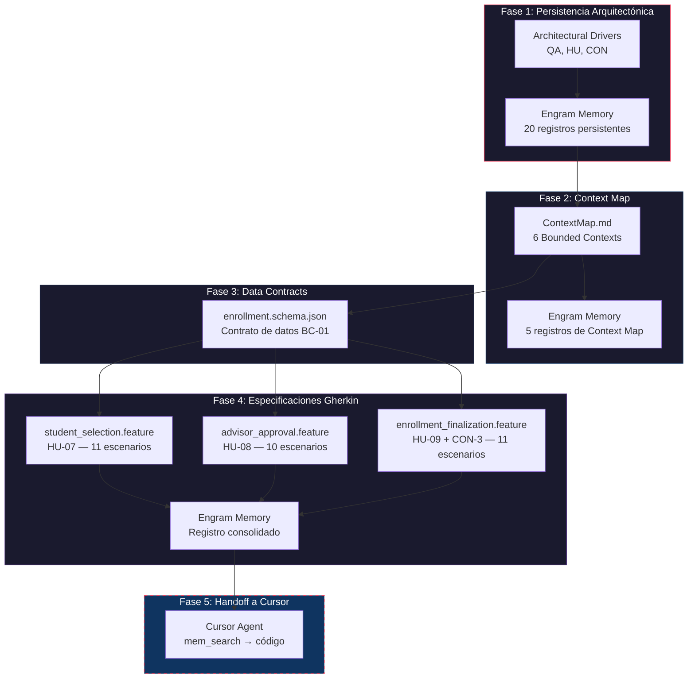
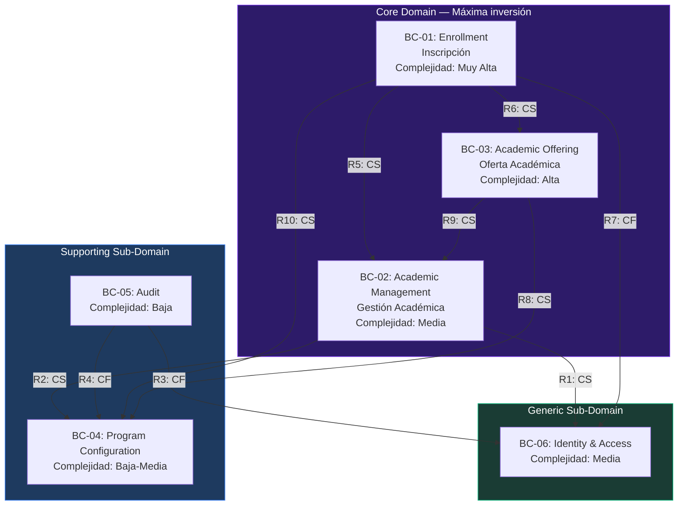
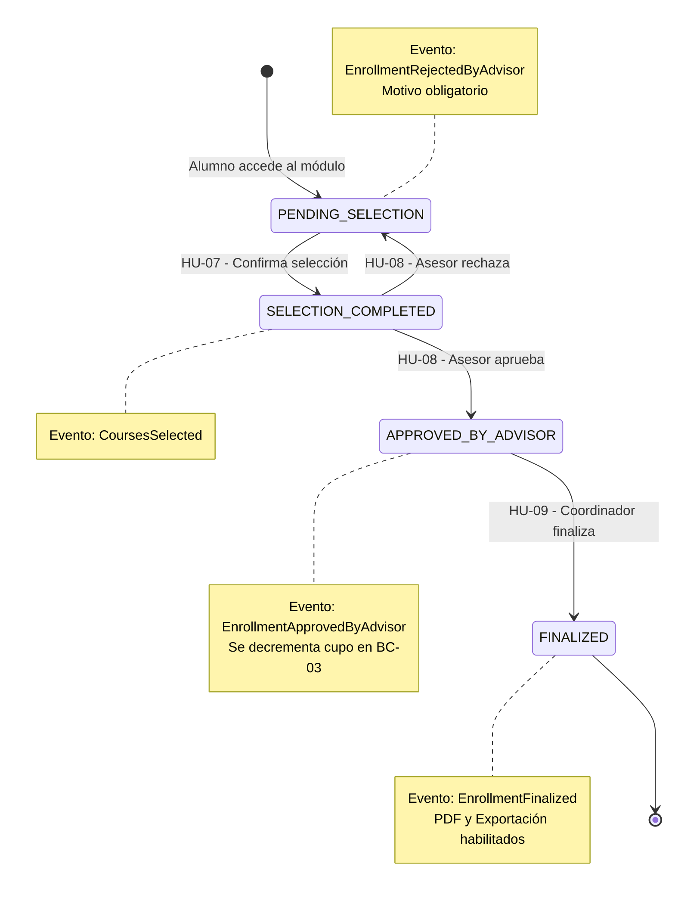

# Specification Summary — SAPCyTI

> **Fecha**: 27 de abril de 2026
> **Metodología**: Specification-Driven Development (SDD) + Domain-Driven Design (DDD)
> **Framework de IA**: Gentleman-AI (Engram MCP + Context7)
> **Herramientas**: Mission Control (Antigravity) → Cursor (implementación)

---

## 1. Objetivo de esta sesión

Formalizar la documentación arquitectónica y las especificaciones del sistema SAPCyTI como **artefactos machine-readable**, de forma que un agente de IA (Cursor con Engram) pueda entender las dependencias del sistema, los contratos de datos y las reglas de negocio sin ambigüedad para generar código alineado con la arquitectura.

### Flujo metodológico SDD + DDD



---

## 2. Trabajo realizado

### 2.1 Fase 1 — Persistencia de Architectural Drivers en Engram

**Justificación**: Los drivers arquitectónicos son las restricciones fundamentales que condicionan TODAS las decisiones de diseño. Persistirlos en Engram garantiza que cualquier agente de IA, en cualquier sesión futura, pueda consultar las restricciones del sistema antes de generar código.

Se crearon **20 registros en Engram** organizados por categoría:

| Categoría | Cantidad | Topic Keys | Ejemplo |
|:----------|:---------|:-----------|:--------|
| Atributos de Calidad | 6 | `architecture/quality-attribute-qa*` | QA-1: RBAC, QA-2: CWE Top 25, QA-3: Parametrización, QA-4: Multi-posgrado, QA-5: Portabilidad nube, QA-6: i18n |
| Requerimientos Funcionales | 7 | `requirements/hu-*` | HU-01 (Auth), HU-15 (Alta alumnos), HU-21 (Alta profesores), HU-06 (Carga horarios), HU-07 (Inscripción), HU-08 (Aprobación asesor), HU-09 (PDF inscripción) |
| Restricciones Globales UAM | 7 | `constraints/con-*` | CON-1 a CON-7 marcadas como "Global Constraint UAM" |

**Relaciones resueltas**: 45 relaciones `related` juzgadas entre drivers interdependientes.

### 2.2 Fase 2 — Context Map (ContextMap.md)

**Justificación**: El Context Map es el artefacto central de DDD estratégico. Define las fronteras de cada módulo, sus relaciones de dependencia y los contratos de comunicación. Sin este documento, un agente de IA no puede saber qué módulo es responsable de qué, ni cómo los módulos se comunican entre sí.

**Archivo generado**: [`Docs/specifications/ContextMap.md`](ContextMap.md)

#### 2.2.1 Bounded Contexts identificados



#### 2.2.2 Secciones del Context Map

| Sección | Contenido | Propósito para la IA |
|:--------|:----------|:---------------------|
| **1. Bounded Contexts** | 6 BCs con aggregates, responsabilidades, drivers, complejidad | Saber QUÉ hace cada módulo |
| **2. Shared Kernel** | No hay SK formal; documenta ID-references y contratos transversales | Saber CÓMO se comunican los módulos |
| **3. Relaciones y Dependencias** | 12 relaciones activas (CS/CF/ACL) + grafo de instanciación | Saber el ORDEN de dependencias |
| **4. External Integrations** | SIIUAM (TXT/XLSX), CSV import, WordPress, Email | Saber los LÍMITES del sistema |
| **5. Trazabilidad** | Matriz drivers → bounded contexts | VERIFICAR cobertura |

#### 2.2.3 Persistencia en Engram

5 registros con topic keys dedicados:

| Topic Key | Contenido |
|:----------|:----------|
| `architecture/context-map` | Resumen general del Context Map |
| `architecture/bounded-contexts` | 6 BCs con aggregates y responsabilidades |
| `architecture/shared-kernel` | ID-references y contratos transversales |
| `architecture/context-relations` | 12 relaciones DDD activas |
| `architecture/external-integrations` | Detalle técnico de SIIUAM, CSV, WordPress, Email |

### 2.3 Fase 3 — Data Contract (JSON Schema)

**Justificación**: El JSON Schema actúa como el **contrato de datos** entre la especificación (.feature) y la implementación (Java). Define los tipos exactos, campos requeridos, enums de estado, y la estructura de los commands. Sin este contrato, los escenarios Gherkin usarían tipos ambiguos y el código generado podría no coincidir con el modelo de dominio.

**Archivo generado**: [`Docs/specifications/schemas/enrollment.schema.json`](schemas/enrollment.schema.json)

| Definición | Tipo DDD | Propósito |
|:-----------|:---------|:----------|
| `Enrollment` | Aggregate Root | Estado, fechas, lista de selecciones |
| `UEASelection` | Entity | Selección individual de grupo/UEA dentro de una inscripción |
| `EnrollmentStatus` | Value Object (Enum) | Máquina de estados: `PENDING_SELECTION` → `SELECTION_COMPLETED` → `APPROVED_BY_ADVISOR` → `FINALIZED` |
| `SelectCoursesCommand` | Command DTO | Input para HU-07 (alumno selecciona UEAs) |
| `ApproveEnrollmentCommand` | Command DTO | Input para HU-08 (asesor aprueba) |
| `RejectEnrollmentCommand` | Command DTO | Input para HU-08 (asesor rechaza) |
| `FinalizeEnrollmentCommand` | Command DTO | Input para HU-09 (coordinador finaliza) |
| `EnrollmentFormPDF` | Read Model | Modelo para generación de PDF on-demand |
| `SchoolSystemsExport` | Export Model | Modelo para exportación TXT/XLSX (CON-3) |

**Decisión de tipos verificada**: Todos los IDs son `Long` (entero de 64 bits) según el modelo de dominio en Architecture.md §4. En JSON Schema se mapean como `"type": "integer"`.

### 2.4 Fase 4 — Especificaciones Gherkin (.feature)

**Justificación**: Los archivos `.feature` son la especificación ejecutable del sistema. Cada escenario es un contrato de comportamiento que:
1. Puede ser leído por el equipo de negocio (lenguaje ubicuo UAM)
2. Puede ser ejecutado como test automatizado
3. Puede ser consumido por un agente de IA para generar implementación alineada

**Directorio**: `Docs/specifications/features/enrollment/`

#### Estructura de carpetas por Bounded Context (DDD)

```
Docs/specifications/
├── ContextMap.md
├── Summary.md                          ← Este documento
├── schemas/
│   └── enrollment.schema.json
└── features/
    └── enrollment/                     ← BC-01: Core Domain
        ├── student_selection.feature   ← HU-07
        ├── advisor_approval.feature    ← HU-08
        └── enrollment_finalization.feature ← HU-09 + CON-3
```

#### Features generados

##### Feature 1: `student_selection.feature` (HU-07)

| Aspecto | Detalle |
|:--------|:--------|
| **Actor** | Alumno |
| **Escenarios** | 11 (6 happy path + 5 alternativos/error) |
| **Drivers cubiertos** | HU-07, QA-1 (RBAC), QA-2 (CWE), QA-3 (límite UEAs) |
| **Estado resultante** | `PENDING_SELECTION` → `SELECTION_COMPLETED` |

Escenarios clave:
- Acceso al módulo y visualización de datos personales
- Pre-selección automática de UEAs según plan académico
- Selección/deselección manual con actualización visual
- Confirmación con transición de estado y evento `CoursesSelected`
- Validación de cupo agotado (cupoDisponible = 0)
- Validación de periodo cerrado (estado del trimestre ≠ IN_ENROLLMENT)
- RBAC: solo rol STUDENT accede
- CWE: protección contra IDs manipulados

##### Feature 2: `advisor_approval.feature` (HU-08)

| Aspecto | Detalle |
|:--------|:--------|
| **Actor** | Profesor (Tutor/Asesor) |
| **Escenarios** | 10 (6 happy path + 4 alternativos/error) |
| **Drivers cubiertos** | HU-08, QA-1 (RBAC — solo asesor asignado), QA-2 (validación) |
| **Estado resultante** | `SELECTION_COMPLETED` → `APPROVED_BY_ADVISOR` o → `PENDING_SELECTION` (rechazo) |

Escenarios clave:
- Lista de alumnos asesorados con inscripciones pendientes
- Revisión detallada y modificación de la carga académica
- Aprobación exitosa con decremento de cupo en BC-03
- Rechazo con motivo obligatorio (min. 10 caracteres)
- RBAC: solo el asesor asignado puede aprobar
- Detección de empalmes de horario

##### Feature 3: `enrollment_finalization.feature` (HU-09 + CON-3)

| Aspecto | Detalle |
|:--------|:--------|
| **Actor** | Coordinador / Asistente |
| **Escenarios** | 11 (6 happy path + 2 exportación + 3 error) |
| **Drivers cubiertos** | HU-09, CON-3 (TXT/XLSX), CON-5 (flexibilidad comisión), QA-1 |
| **Estado resultante** | `APPROVED_BY_ADVISOR` → `FINALIZED` |

Escenarios clave:
- Generación de PDF on-demand con datos verificados
- Validación de contenido del PDF (matrícula, UEAs, firmas)
- Finalización con registro de fecha y evento `EnrollmentFinalized`
- Re-impresión para alumnos ya finalizados
- Exportación TXT para Sistemas Escolares (Anti-Corruption Layer)
- Exportación XLSX para Sistemas Escolares
- CON-5: la comisión del posgrado tiene la decisión final

#### Convenciones aplicadas en los .feature

| Convención | Ejemplo | Propósito |
|:-----------|:--------|:----------|
| **Background robusto** | `Dado que el trimestre "25P" tiene estado "IN_ENROLLMENT" según BC-03` | Establecer estado de otros BCs sin repetir su lógica |
| **Tags de trazabilidad** | `@requirement:HU-07 @driver:QA-1 @priority:alta` | Mapear a registros de Engram |
| **Tags de módulo** | `@module:enrollment @bounded-context:BC-01 @subdomain:core` | Identificar contexto DDD |
| **Lenguaje ubicuo** | UEA, Trimestre, Matrícula, Cupo, Asesor | Vocabulario de la UAM |
| **Referencia a schema** | `Schema: enrollment.schema.json#/definitions/SelectCoursesCommand` | Vincular al contrato de datos |
| **Idioma** | `# language: es` | Gherkin en español |

---

## 3. Flujo completo de Enrollment — Estado final documentado



---

## 4. Inventario de artefactos en Engram

Todos los artefactos generados están persistidos en Engram para consumo cross-session. Cuando se abra Cursor, el agente puede ejecutar `mem_search("enrollment features")` o `mem_search("context map")` para recuperar el contexto completo.

| Topic Key | Tipo | Contenido |
|:----------|:-----|:----------|
| `architecture/quality-attribute-qa1` a `qa6` | architecture | 6 atributos de calidad |
| `requirements/hu-01` a `hu-21` | architecture | 7 requerimientos funcionales MVP |
| `constraints/con-1` a `con-7` | decision | 7 restricciones globales UAM |
| `architecture/context-map` | architecture | Resumen general del Context Map |
| `architecture/bounded-contexts` | architecture | 6 BCs con aggregates |
| `architecture/shared-kernel` | architecture | ID-references y contratos |
| `architecture/context-relations` | architecture | 12 relaciones DDD |
| `architecture/external-integrations` | architecture | Integraciones externas |
| `specifications/enrollment-features` | architecture | 3 features con 32 escenarios |

**Total**: 26 registros en Engram + 63 relaciones juzgadas.

---

## 5. Justificaciones de diseño

### 5.1 ¿Por qué SDD + DDD?

| Pregunta | Respuesta |
|:---------|:----------|
| ¿Por qué DDD? | El dominio de gestión de posgrado tiene reglas complejas (multi-actor, multi-programa, máquinas de estado). DDD hace explícitas las fronteras entre responsabilidades y evita que un cambio en Enrollment rompa Academic Offering. |
| ¿Por qué SDD? | El equipo de desarrollo rota cada semestre (CON-6: alumnos de licenciatura). Las especificaciones ejecutables son la documentación que no se desactualiza porque fallan si no coinciden con el código. |
| ¿Por qué Gentleman-AI? | El framework de agentes de IA (Engram + SDD skills) permite que el conocimiento arquitectónico sobreviva entre sesiones y entre herramientas (Mission Control → Cursor). Sin persistencia, cada sesión de IA empieza desde cero. |

### 5.2 ¿Por qué JSON Schema como contrato de datos?

- **Validable**: Se puede ejecutar validación automática contra payloads de API
- **Framework-agnostic**: No depende de Java, Spring, ni ningún framework específico
- **Machine-readable**: Un agente de IA puede parsear el schema para generar DTOs, validaciones Bean Validation, y mappers MapStruct
- **Versionable**: Se commitea en git y tiene diff legible

### 5.3 ¿Por qué Gherkin en español?

- El dominio de la UAM usa vocabulario específico en español (UEA, Trimestre, Matrícula)
- Los stakeholders (Coordinador, profesores, asistente administrativa) leen español
- Usar inglés introduciría traducciones ambiguas del vocabulario ubicuo
- El tag `# language: es` es soportado por todas las herramientas Gherkin (Cucumber, Behave, etc.)

### 5.4 ¿Por qué Background robusto con referencias a otros BCs?

- Evita duplicación de lógica entre features de diferentes módulos
- Hace explícitas las dependencias upstream para el agente de IA
- Si un BC upstream cambia (ej. Student agrega un campo), los Backgrounds que lo referencian señalan dónde actualizar

---

## 6. Consideraciones futuras

### 6.1 Módulos pendientes de especificación

| Orden | Módulo | Prioridad | Dependencia |
|:------|:-------|:----------|:------------|
| 1 | ✅ **BC-01: Enrollment** | Completado en esta sesión | — |
| 2 | BC-03: Academic Offering | Alta (prerequisito de Enrollment) | Schema: `academic-offering.schema.json` |
| 3 | BC-02: Academic Management | Alta (HU-15, HU-21) | Schema: `academic-management.schema.json` |
| 4 | BC-06: Identity & Access | Alta (HU-01, base RBAC) | Schema: `identity-access.schema.json` |
| 5 | BC-04: Program Configuration | Media (QA-3, QA-4) | Schema: `program-configuration.schema.json` |
| 6 | BC-05: Audit | Baja (consumidor pasivo) | Schema: `audit.schema.json` |

### 6.2 Evolución técnica

| Área | Estado actual | Evolución posible | Driver |
|:-----|:-------------|:-------------------|:-------|
| **Domain Events** | Síncronos in-process (JPA + AOP) | Asíncronos con message broker | QA-5 (portabilidad nube) |
| **ID Strategy** | `Long` (auto-increment) | UUID v7 (si se extrae a microservicios) | QA-5 |
| **Integración WordPress** | Planificada, no instanciada | REST API asíncrona con ACL | CON-4 |
| **Integración Conacyt/SNP** | No definida aún | Generación de paquetes de evidencia | CAR-13, CAR-14 |
| **Bounded Context extraction** | Monolito modular | Service extraction por BC | QA-5 |
| **Formato de exportación** | TXT/XLSX (especificación pendiente de César Hernández) | Formato formalizado con versionamiento | CON-3 |

### 6.3 Riesgos identificados

| Riesgo | Impacto | Mitigación |
|:-------|:--------|:-----------|
| El formato exacto de TXT/XLSX de Sistemas Escolares no está formalizado | El ACL exporta datos incorrectos | Formalizar el formato con César Hernández antes de implementar R12 |
| Rotación del equipo de desarrollo cada semestre | Pérdida de contexto arquitectónico | Engram persiste decisiones + SDD produce specs ejecutables |
| Pre-selección automática de UEAs no está completamente definida | Lógica de negocio ambigua en HU-07 | Clarificar algoritmo con el Coordinador antes de implementar |
| Empalmes de horario: ¿bloquear o advertir? | Comportamiento inconsistente en HU-08 | Definir política con la comisión (actualmente: advertencia, no bloqueo) |
| Generación de PDF: ¿librería específica? | Dependencia no declarada en CON-1 (Open Source) | Evaluar iText (AGPL) vs Apache PDFBox (Apache 2.0) vs OpenPDF (LGPL) |

### 6.4 Checklist para el siguiente módulo

Antes de generar especificaciones para el siguiente Bounded Context, verificar:

- [ ] ¿Existe el JSON Schema (`*.schema.json`) con todos los aggregates y commands?
- [ ] ¿Están persistidos los drivers relevantes en Engram?
- [ ] ¿El ContextMap.md refleja las relaciones del módulo?
- [ ] ¿Se identificaron todas las HUs que cubrir?
- [ ] ¿Se definió el lenguaje ubicuo del módulo?

---

## 7. Referencias

| Documento | Ruta | Propósito |
|:----------|:-----|:----------|
| Architectural Drivers | [`Docs/ArchitecturalDrivers.md`](../ArchitecturalDrivers.md) | Drivers QA, HU, CON |
| Architecture | [`Docs/Design/Architecture.md`](../Design/Architecture.md) | Modelo de dominio, componentes, decisiones |
| Context Map | [`Docs/specifications/ContextMap.md`](ContextMap.md) | Bounded Contexts y relaciones DDD |
| Enrollment Schema | [`Docs/specifications/schemas/enrollment.schema.json`](schemas/enrollment.schema.json) | Contrato de datos BC-01 |
| Vision | [`Docs/visionDocs/Vision.md`](../visionDocs/Vision.md) | Alcance y características del sistema |
| Atributos y Restricciones | [`Docs/Analisis_Requerimientos/Atributos_y_Restricciones.md`](../Analisis_Requerimientos/Atributos_y_Restricciones.md) | Restricciones técnicas UAM |
| HU-07 | [`Docs/visionDocs/HU/HU-07.md`](../visionDocs/HU/HU-07.md) | Selección de UEAs |
| HU-08 | [`Docs/visionDocs/HU/HU-08.md`](../visionDocs/HU/HU-08.md) | Aprobación por asesor |
| HU-09 | [`Docs/visionDocs/HU/HU-09.md`](../visionDocs/HU/HU-09.md) | Formato de inscripción |
