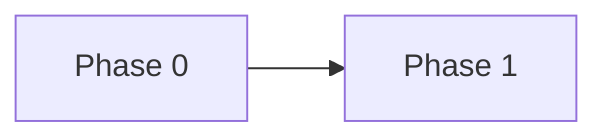

# Implementation Plan — {Project Name}

## 1. Introduction

This document is the **central index** for the implementation plan. Per-phase task detail and checkboxes live in separate `phaseX.md` files. Each task in those files references a **Spec** from [`SDD/specs/`](../SDD/specs/).

The [`progress.md`](progress.md) file is the **project memory**: decisions, blockers, conventions, and session notes — no task tracking.

---

## 2. Phase Overview

| Phase | Name | Primary goal | ADD Iteration | Spec Count |
|-------|------|--------------|---------------|------------|
| **0** | {name} | {goal} | {N} | {count} |
| **1** | {name} | {goal} | {N} | {count} |

---

## 3. Phase Dependencies

| Phase | Depends on | Reason |
|-------|------------|--------|
| **1** | 0 | {reason} |

---

## 4. Phase Transition Criteria

| Criterion | Description |
|-----------|-------------|
| **Deliverables complete** | Every deliverable for the phase is produced and verified |
| **Tests pass** | All test suites pass at 100% in CI |
| **Coverage met** | ≥80% code coverage |
| **No regressions** | Functionality from earlier phases still works |
| **Specs implemented** | All linked specs in `phaseX.md` are ✅ Implemented |
| **Hexagonal conventions** | New code follows hexagonal package layout from [`Architecture.md §6.1`](../Design/Architecture.md) |
| **Documentation updated** | README, API docs, and architecture diagrams are current |

---

## 5. Driver Traceability by Phase

| Category | Drivers | Phase |
|----------|---------|-------|
| {category} | {drivers} | {N} |

---

## 6. Selected Technology Stack

> Full details in [`SDD/technologies/`](../SDD/technologies/).

**Frontend:** See [`technologies/frontend.md`](../SDD/technologies/frontend.md)
**Backend:** See [`technologies/backend.md`](../SDD/technologies/backend.md)
**Testing:** See [`technologies/testing.md`](../SDD/technologies/testing.md)
**DevOps:** See [`technologies/devops.md`](../SDD/technologies/devops.md)

---

## 7. Environment Strategy

> {Description of deployment strategy — local Docker → on-premise → cloud}

---

## 8. Risk Matrix

> Riesgos a nivel proyecto. Para riesgos específicos de un phase, ver la sección Risks del `phaseX.md` correspondiente.

| # | Risk | Impact | Probability | Mitigation | Owner |
|---|------|--------|-------------|------------|-------|
| R-001 | {e.g., "Student leaves mid-phase"} | Alto | Alta | {e.g., "Specs are self-contained — new student picks up next spec"} | {rol} |
| R-002 | {e.g., "PostgreSQL version mismatch dev vs prod"} | Medio | Baja | {e.g., "Docker Compose pins `postgres:16` in all environments"} | {rol} |
| R-003 | {e.g., "LLM hallucinates cross-module imports"} | Medio | Media | {e.g., "Spec Out of Scope + Conventions Checklist restrict scope"} | {rol} |

---

## 9. Team Onboarding

> Guía de lectura para un nuevo estudiante o LLM session. Leer en este orden.

| Step | Document | Purpose | Time |
|------|----------|---------|------|
| 1 | [`SDD-theory/SDD-theory.md`](../SDD-theory/SDD-theory.md) | Entender cómo trabajamos | 15 min |
| 2 | This file (`implementationPlan.md`) | Visión general de fases y stack | 10 min |
| 3 | [`progress.md`](progress.md) → Active Conventions | Reglas obligatorias de código | 10 min |
| 4 | [`technologies/{area}.md`](../SDD/technologies/) | Stack del área que vas a trabajar | 10 min |
| 5 | [`SPEC_INDEX.md`](../SDD/SPEC_INDEX.md) | Ubicar la spec asignada | 5 min |
| 6 | La spec específica `SPEC-XXX.md` | Contrato técnico a implementar | 15 min |
| 7 | [`Architecture.md`](../Design/Architecture.md) — solo las secciones referenciadas | Contexto arquitectónico | 10 min |

**Total onboarding:** ~75 min hasta ser productivo.

---

## 10. Spec-Driven Development Integration

### Workflow
1. Before implementing any task in `phaseX.md`, a Spec must exist in [`SDD/specs/`](../SDD/specs/)
2. Spec is reviewed and moved to 🔵 Approved status
3. Implementation follows the Spec — deviations require Spec amendment
4. PR references the Spec ID: `feat({module}): SPEC-{NNN} {description}`
5. Upon merge, Spec → ✅ Implemented; task in `phaseX.md` → checked ✅

### Spec Coverage by Phase

| Phase | Tasks | Specs Required | Status |
|-------|-------|----------------|--------|
| {N} | {count} | {count} | {status} |

### Reference Documents
- Spec templates: [`SDD/templates/`](../SDD/templates/)
- Spec index: [`SDD/SPEC_INDEX.md`](../SDD/SPEC_INDEX.md)
- SDD theory: [`SDD-theory/SDD-theory.md`](../SDD-theory/SDD-theory.md)
- Technical debt: [`progress.md` → Technical Debt Registry](progress.md)
