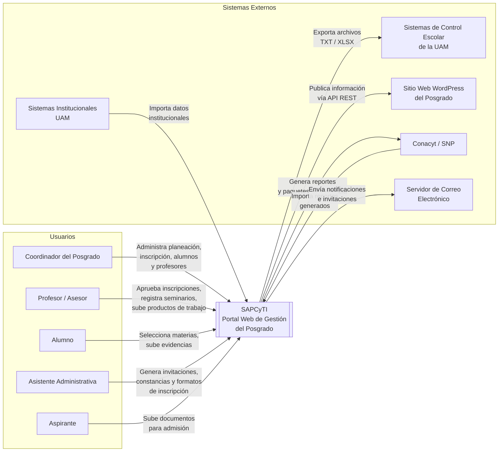

# Architectural Drivers — SAPCyTI

- **Autor**: Humberto Cervantes Maceda  
- **Fecha**: 27/02/2026 (HU MVP actualizadas según [`Architecture.md`](Architecture.md) §3 — mayo 2026)

---

## 1. Contexto del Sistema

El Posgrado en Ciencias y Tecnologías de la Información (PCyTI) de la UAM opera actualmente con procesos manuales apoyados en hojas de cálculo, lo que genera una carga administrativa elevada, duplicación de capturas y dificultad para producir las evidencias que exige el Sistema Nacional de Posgrados (SNP) del Conacyt.

**SAPCyTI** es un portal web hecho a la medida que centraliza la gestión del posgrado: planeación trimestral, inscripción de alumnos, administración de expedientes académicos, organización de seminarios, y generación de reportes y evidencias. Se despliega inicialmente en un servidor on-premise dedicado (Linux, 32 GB RAM, 16 TB) y debe integrarse con varios sistemas institucionales y externos.

El siguiente diagrama muestra los actores y sistemas externos que interactúan con SAPCyTI:

Los cinco tipos de usuario acceden al sistema a través de un navegador web. El Coordinador es el actor principal y tiene acceso a todas las funciones; los demás roles interactúan con subconjuntos específicos según sus responsabilidades. En el lado de sistemas externos, las integraciones más críticas para el MVP son la exportación hacia Sistemas de Control Escolar (requerida para formalizar inscripciones) y el servidor de correo (requerido para notificaciones del flujo de inscripción).

---

## 2. Requerimientos Funcionales Primarios

Los requerimientos funcionales primarios se seleccionaron a partir de las 35 historias de usuario en [`vision/HU/`](../vision/HU/00-INDICE.md), priorizando las que conforman el **MVP** planificado en el diseño ADD.

> **Fuente de verdad (HU del MVP):** [`Architecture.md`](Architecture.md) §3 — *User stories (MVP)*.  
> Este apartado reproduce el mismo conjunto en español y enlaza el detalle de cada tarjeta en `vision/HU/`. Si hay discrepancia, prevalece `Architecture.md`.

### Historias de usuario seleccionadas para el MVP

| ID | Iter. ADD | Historia de Usuario | Detalle |
| --- | --- | --- | --- |
| **[HU-01](../vision/HU/HU-01.md)** | 3 | Como usuario del sistema (administrador, profesor u otro rol autorizado), quiero ingresar al sistema mediante mi login y contraseña, para acceder a la pantalla principal con las opciones correspondientes a mi tipo de usuario. | Seguridad / acceso |
| **[HU-02](../vision/HU/HU-02.md)** | 4 | Como usuario registrado del sistema, quiero recuperar mi contraseña cuando la haya olvidado, para restablecer mi acceso al sistema. | Recuperación de contraseña |
| **[HU-03](../vision/HU/HU-03.md)** | 3 | Como usuario autenticado del sistema, quiero cerrar mi sesión cuando termine de utilizar el sistema, para proteger mi información y evitar accesos no autorizados. | Cierre de sesión |
| **[HU-06](../vision/HU/HU-06.md)** | 5 | Como Coordinador del Posgrado, quiero seleccionar un trimestre y cargar el archivo CSV de horarios y sorteos, para habilitar el sistema de inscripción y que los alumnos puedan visualizar las materias disponibles. | Oferta académica |
| **[HU-07](../vision/HU/HU-07.md)** | 5 | Como Alumno del posgrado, quiero acceder al módulo de inscripción para seleccionar las materias que cursaré en el trimestre, para registrar mi carga académica y avanzar en mi programa de estudios. | Selección de UEA |
| **[HU-08](../vision/HU/HU-08.md)** | 5 | Como Profesor (Tutor o Asesor), quiero acceder a la lista de mis alumnos asesorados y revisar las UEA que han seleccionado, para validar que su carga académica sea la adecuada, realizando ajustes si es necesario, y autorizar formalmente su inscripción. | Aprobación del asesor |
| **[HU-09](../vision/HU/HU-09.md)** | 5 | Como Coordinador o Asistente del Posgrado, quiero seleccionar a un alumno cuya carga académica ya fue aprobada para generar su formato de inscripción, para obtener el documento oficial en PDF que formaliza el registro de materias ante Sistemas Escolares. | Formato PDF / exportación |
| **[HU-10](../vision/HU/HU-10.md)** | 5 | Como Coordinador del Posgrado, quiero modificar manualmente el estado del proceso de inscripción de cualquier alumno y visualizar un resumen general, para corregir errores en el flujo o dar por finalizado el proceso de manera administrativa. | Gestión administrativa de estados |
| **[HU-15](../vision/HU/HU-15.md)** | 4 | Como Coordinador del posgrado, quiero dar de alta a un alumno con sus datos personales y académicos, para administrar su expediente y permitir su acceso al sistema. | Alta de alumnos |
| **[HU-21](../vision/HU/HU-21.md)** | 4 | Como Coordinador del posgrado, quiero dar de alta a un profesor en el sistema, para que pueda impartir materias y asesorar alumnos. | Alta de profesores |
| **[HU-28](../vision/HU/HU-28.md)** | 4 | Como Coordinador del posgrado (o usuario), quiero cambiar la contraseña de acceso, para mantener la seguridad de la cuenta o recuperarla. | Cambio de contraseña |

**Resumen por iteración ADD** (véase [`IterationPlan.md`](IterationPlan.md)):

- **Iteración 3:** HU-01, HU-03 — infraestructura de seguridad y autenticación.
- **Iteración 4:** HU-15, HU-21, HU-02, HU-28 — gestión de entidades y flujos de credenciales (+ QA-6 i18n).
- **Iteración 5:** HU-06, HU-07, HU-08, HU-09, HU-10 — flujo de inscripción (+ CON-3 exportación TXT/XLSX).

---

## 3. Atributos de Calidad

Se seleccionaron los atributos de calidad que, además de ser los más relevantes para el negocio del posgrado, presentan una **dificultad alta de implementación** y, por tanto, condicionan decisiones arquitectónicas tempranas. La selección se realizó a partir del análisis documentado en `requirements/Atributos_y_Restricciones.md`.

| ID | Atributo de Calidad | Escenario | Relevancia para el negocio | Dificultad |
| -- | ------------------- | --------- | -------------------------- | ---------- |
| **QA-1** | Seguridad — Control de acceso por roles | El sistema debe restringir las funciones disponibles según el tipo de usuario (Coordinador, Profesor, Alumno, Asistente, Ponente). Un usuario que no tenga el rol adecuado no debe poder acceder a funciones que no le corresponden. | Alta — El MVP ya involucra tres roles distintos en el flujo de inscripción; una falla de control de acceso comprometería datos académicos sensibles. | Alta — Es una preocupación transversal (cross-cutting) que permea cada endpoint y vista del sistema y debe diseñarse desde la capa de arquitectura, no añadirse después. |
| **QA-2** | Seguridad — Protección contra vulnerabilidades CWE Top 25 | El sistema no debe ser vulnerable a los errores listados en el CWE MITRE Top 25 (inyección SQL, XSS, CSRF, etc.). | Alta — El sistema almacena datos personales y académicos de alumnos y profesores; una brecha tendría consecuencias institucionales graves. | Alta — Requiere prácticas sistemáticas en todas las capas (validación de entrada, parametrización de consultas, sanitización de salida, manejo seguro de sesiones) y no puede resolverse con una sola decisión puntual. |
| **QA-3** | Modificabilidad — Parametrización de reglas de negocio | Los cambios en reglas de operación del posgrado (fechas, cupos, criterios de evaluación) deben poder realizarse en un solo punto de configuración, sin modificar el código fuente. | Alta — Las reglas cambian entre trimestres y la operación depende de que el Coordinador pueda ajustar parámetros sin intervención de desarrolladores; además, el equipo de desarrollo son alumnos de licenciatura con estancias cortas. | Alta — Exige diseñar un mecanismo de configuración externalizada y evitar valores fijos dispersos en el código, lo cual impacta la estructura de capas y el modelo de datos desde el inicio. |
| **QA-4** | Escalabilidad — Soporte multi-posgrado | El sistema debe poder adaptarse para administrar hasta 9 posgrados divisionales con reglas de negocio propias, sin requerir cambios estructurales en el núcleo de la aplicación. | Alta — Es un objetivo estratégico explícito de la institución (NEC-7, CAR-13/CAR-20) y determina el retorno de inversión a largo plazo del proyecto. | Muy alta — Implica un diseño multi-tenant o altamente parametrizable desde el modelo de datos y la lógica de negocio; retrofitear esta capacidad en una arquitectura monolítica rígida sería prohibitivamente costoso. |
| **QA-5** | Portabilidad — Preparación para migración a nube | El diseño debe facilitar una futura migración del servidor on-premise actual hacia un entorno de nube, sin reescritura significativa de la aplicación. | Media-Alta — Aunque el despliegue inicial es on-premise (servidor Linux dedicado, 32 GB RAM, 16 TB), la institución prevé una eventual migración a nube para mejorar disponibilidad y reducir riesgos operativos. | Alta — Requiere desacoplar la aplicación de supuestos de infraestructura local (rutas de sistema de archivos, configuración de red fija) y adoptar patrones portables (contenedores, configuración por entorno, almacenamiento abstracto) desde las primeras iteraciones. |
| **QA-6** | Usabilidad — Internacionalización (i18n) | El sistema debe poder presentar su interfaz en español e inglés para soportar convenios de doble titulación con universidades extranjeras. | Media-Alta — Requisito explícito derivado de NEC-7 y necesario para los procesos de acreditación internacional del posgrado. | Alta — La internacionalización es una preocupación transversal que afecta todas las vistas, mensajes de error, reportes generados y plantillas de documentos; incorporarla después de construir el sistema multiplica el esfuerzo por un factor significativo. |

---

## 4. Restricciones

Las restricciones son decisiones que ya han sido tomadas y que limitan el espacio de diseño. Se extraen del documento `requirements/Atributos_y_Restricciones.md` y del documento de Visión.

| ID | Restricción |
| -- | ----------- |
| **CON-1** | El back-end debe desarrollarse en **Java** utilizando exclusivamente librerías **Open Source**. |
| **CON-2** | El despliegue inicial será **on-premise** sobre un servidor dedicado con Linux, 16 TB de almacenamiento y 32 GB de RAM. |
| **CON-3** | La exportación de datos de inscripción hacia Sistemas Escolares debe realizarse mediante archivos estructurados en formato **TXT o XLSX**, según los requerimientos de la oficina de Control Escolar. |
| **CON-4** | El sistema debe integrarse de forma asíncrona con la **página web WordPress** del posgrado para evitar doble captura de información. |
| **CON-5** | Los flujos que dependen de validación institucional externa (ej. Admisión, Rectoría, Sistemas Escolares) **no deben forzar reglas rígidas**; la decisión final debe quedar a cargo de la comisión del posgrado. |
| **CON-6** | El proyecto será desarrollado por **estudiantes de licenciatura** con estancias cortas y recursos limitados, bajo un esquema de liberación iterativo e incremental. |
| **CON-7** | El sistema debe ser accesible desde los navegadores **Chrome 130, Safari 22 y Firefox 129**, y ser responsivo para tablets y teléfonos. |
