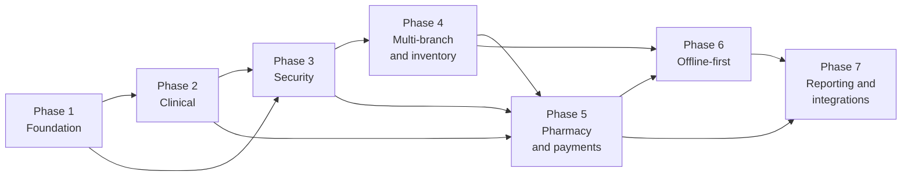
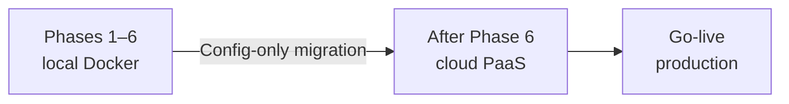

# Implementation Plan — SICEB

## 1. Introduction

This document is the **central index** for the SICEB implementation plan. Per-phase task detail, checkboxes, and progress notes live in separate files. The [`progress.md`](progress.md) file is the **project memory**: current state, decisions, and open items.

**Environment strategy:**

| Stage | Environment | Infrastructure | When |
|-------|---------------|----------------|------|
| **Development** | Local with Docker | PostgreSQL, API server, and PWA in Docker Compose | Phases 1–6 (current) |
| **Production** | Cloud PaaS | Migration to managed services (DB, PaaS, CDN, LB) | After Phase 6, before go-live |

All development and testing run **locally with Docker**. The architecture is cloud-ready from day one (environment variables, no host path dependencies, portable Docker images) so cloud migration is infrastructure configuration, not code rewrites.

| File | Content |
|------|---------|
| [`implementationPlan.md`](implementationPlan.md) | This file — overview, dependencies, stack, transition criteria |
| [`progress.md`](progress.md) | Project memory — phase status, decisions, blockers |
| [`phase1-foundation.md`](phase1-foundation.md) | Phase 1 — Foundation and system structure |
| [`phase2-clinical.md`](phase2-clinical.md) | Phase 2 — Core clinical workflow and medical records |
| [`phase3-security.md`](phase3-security.md) | Phase 3 — Security, access control, and audit |
| [`phase4-inventory.md`](phase4-inventory.md) | Phase 4 — Multi-branch operations and inventory |
| [`phase5-pharmacy.md`](phase5-pharmacy.md) | Phase 5 — Pharmacy, payments, and regulatory compliance |
| [`phase6-offline.md`](phase6-offline.md) | Phase 6 — Offline-first architecture and synchronization |
| [`phase7-reporting.md`](phase7-reporting.md) | Phase 7 — Reporting, integrations, and operational resilience |
| [`requeriments1.md`](requeriments1.md) | ADD specification — Iteration 1 |
| [`requeriments2.md`](requeriments2.md) | ADD specification — Iteration 2 |
| [`requeriments3.md`](requeriments3.md) | ADD specification — Iteration 3 |

---

## 2. Phase Overview

| Phase | Name | Primary goal | ADD iteration |
|-------|------|--------------|----------------|
| **1** | Foundation and system structure | Base infrastructure, modular monolith, technical conventions, CI/CD | Iteration 1 |
| **2** | Core clinical workflow | Patients, consultations, prescriptions, laboratory, immutable record | Iteration 2 |
| **3** | Security and audit | Authentication, 3D RBAC, security pipeline, audit log, LFPDPPP | Iteration 3 |
| **4** | Multi-branch and inventory | Branch management, delta inventory, multi-tenant scalability | Iteration 4 |
| **5** | Pharmacy, payments, regulatory | Dispensing, COFEPRIS, payments, supply chain, offline compensation | Iteration 5 |
| **6** | Offline-first | Offline operation, synchronization, conflict resolution | Iteration 6 |
| **7** | Reporting and integrations | Financial reporting, CFDI, API versioning, resilience, backups | Iteration 7 |

---

## 3. Phase Dependencies

| Phase | Depends on | Reason |
|-------|------------|--------|
| **2** | 1 | Requires Shared Kernel, scaffolds, and configured DB |
| **3** | 1, 2 | Security protects clinical modules already built |
| **4** | 3 | RBAC and RLS are prerequisites for multi-branch isolation |
| **5** | 2, 3, 4 | Pharmacy depends on prescriptions (P2), RBAC with residency (P3), and inventory (P4) |
| **6** | 4, 5 | Sync protocol needs all modules emitting compatible data |
| **7** | 5, 6 | Reporting consolidates all modules; integrations need a stable API |

---

## 4. Phase Transition Criteria

To move from one phase to the next, **all** of the following must hold:

| Criterion | Description |
|-----------|-------------|
| **Deliverables complete** | Every deliverable for the phase is produced and verified |
| **Tests pass** | Unit, integration, and architecture test suites pass at 100% in CI |
| **Performance verified** | Phase QA performance scenarios meet their targets |
| **No regressions** | Functionality from earlier phases still works |
| **Offline conventions** | New modules comply with CRN-43 conventions verified by architecture tests |
| **Documentation updated** | OpenAPI, architecture diagrams, and decision logs updated |

---

## 5. Driver Traceability by Phase

| Category | Drivers | Phase |
|----------|---------|-------|
| **Structure** | CRN-25, CRN-26, CRN-27, CRN-43, CON-01 to CON-05 | 1 |
| **Multi-tenant** | CRN-29, CRN-41, CRN-42 | 1 |
| **Clinical** | US-024, US-025, US-026, US-031, US-019 to US-042, PER-03, USA-02, AUD-03, CRN-02, CRN-01, CRN-31, CRN-37 | 2 |
| **Security** | US-003, US-001, US-002, US-050, US-051, US-066, SEC-01, SEC-02, SEC-04, MNT-03, CRN-13 to CRN-18, CRN-32 | 3 |
| **Inventory** | US-071, US-074, US-004, US-004, US-005, US-064, PER-01, ESC-01 to ESC-03, CRN-24, CRN-35, CRN-44 | 4 |
| **Pharmacy / payments** | US-044, US-032 to US-044, PER-04, SEC-03, AUD-01, AUD-02, USA-04, CRN-33, CRN-14, CRN-45 | 5 |
| **Offline** | US-076, REL-01, REL-02, USA-01, REL-04, CRN-21, CRN-34, CRN-36, CRN-38, CRN-05, CRN-16, CRN-39 | 6 |
| **Operational** | PER-02, REL-03, MNT-01, MNT-02, USA-03, IOP-01, IOP-02, CRN-04, CRN-06, CRN-08, CRN-09, CRN-11, CRN-19 | 7 |

---

## 6. Selected Technology Stack

**Frontend:** React + TypeScript + Vite + Workbox  
**Backend:** Spring Boot 3.x (Java 21) + Spring Data JPA + PostgreSQL

### Stack libraries

| Layer | Library | Purpose |
|-------|---------|---------|
| **Backend — core** | Spring Boot 3.x, Spring Web, Spring Data JPA, Spring Security, Spring WebSocket | Base framework, REST API, persistence, security, real-time |
| **Backend — persistence** | Hibernate 6.x, PostgreSQL JDBC driver, Flyway | ORM with JSONB support, PostgreSQL driver, versioned migrations |
| **Backend — security** | spring-security-oauth2-resource-server, jjwt (io.jsonwebtoken) | JWT validation, token issuance, refresh token handling |
| **Backend — OpenAPI** | springdoc-openapi 2.x | Auto-generated OpenAPI 3.0 documentation |
| **Backend — testing** | JUnit 5, Mockito, Spring Boot Test, Testcontainers, ArchUnit | Unit, integration with real PostgreSQL, architecture tests |
| **Backend — observability** | Spring Boot Actuator, Micrometer | Health checks, metrics, monitoring |
| **Frontend — core** | React 18+, TypeScript 5.x, Vite | SPA, static typing, build tool |
| **Frontend — state** | Zustand | Lightweight state for ClinicalStateManager and SessionManager |
| **Frontend — PWA** | Workbox (precaching, routing, background-sync), vite-plugin-pwa | Service worker, cache strategies, Background Sync |
| **Frontend — storage** | Dexie.js | Typed IndexedDB with sync queue and branch_id isolation |
| **Frontend — HTTP** | Axios | REST client with JWT auto-refresh interceptors |
| **Frontend — WebSocket** | @stomp/stompjs | STOMP client for real-time events |
| **Frontend — UI** | Ant Design or Shadcn/ui + Tailwind CSS | Enterprise components: tables, forms, wizards |
| **Frontend — testing** | Vitest, React Testing Library, Playwright | Unit, components, E2E |
| **Frontend — forms** | React Hook Form + Zod | Form validation with typed schemas |

### Alternative evaluation

Comparative tables (four frontend and four backend options), full stack justification, driver mapping, and trade-offs with mitigations are recorded in the project history.

---

## 7. Environment Strategy: Local Docker → Cloud

### Principle

> **Develop and validate everything locally with Docker. Migrate to cloud when functionality is proven and stable.**

### Environment phases

### Cloud-ready rules from day one

| Rule | Description | Example |
|------|-------------|---------|
| **Environment variables** | All external configuration via env vars, never hardcoded | `DB_URL`, `JWT_SECRET`, `CORS_ORIGINS` |
| **No local paths** | No dependency on host filesystem paths | Docker volumes for persistent data |
| **Portable Docker images** | Multi-stage builds runnable on any container runtime | Same image for local Docker and Cloud Run / ECS |
| **Health checks** | Actuator endpoints from Phase 1 | `/actuator/health`, `/actuator/readiness` |
| **Versioned migrations** | Flyway manages schema; no manual SQL | Scripts under `db/migration/V001__*.sql` |
| **Structured logs** | JSON logging compatible with aggregators | Logback JSON encoder; no `System.out.println` |

### What changes when moving to cloud

| Component | Local Docker | Cloud |
|-----------|--------------|-------|
| **PostgreSQL** | Docker container with local volume | Managed service (Cloud SQL, RDS, Azure DB) |
| **API server** | Docker container on `localhost:8080` | PaaS (Cloud Run, App Service, ECS Fargate) |
| **PWA client** | Vite dev server in container | Static build on CDN (CloudFront, Cloud CDN, Azure CDN) |
| **CI/CD** | Local pipeline or GitHub Actions against Docker | Same pipeline; deploy target becomes cloud |
| **Secrets** | Local `.env` file | Cloud secret manager |
| **TLS** | Optional locally (self-signed or none) | Mandatory; managed by load balancer / ingress |

### When to migrate

Cloud migration is planned **after Phase 6** when:

1. All functional modules are implemented and tested locally  
2. The full test suite passes at 100% against local Docker  
3. The offline synchronization protocol is validated end-to-end  
4. Cloud provider and operational budget are defined  
