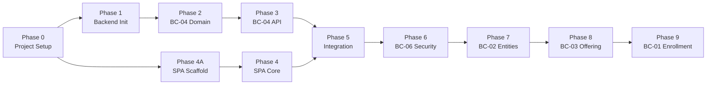
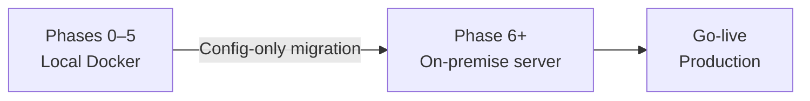

# Implementation Plan — SAPCyTI

## 1. Introduction

This document is the **central index** for the SAPCyTI implementation plan. Per-phase task detail and checkboxes live in separate `phaseX.md` files. Each task in those files references a **Spec** from [`SDD/specs/`](../SDD/specs/).

The [`progress.md`](progress.md) file is the **project memory**: decisions, blockers, conventions, and session notes — no task tracking.

### Domain Artifacts

All specs are derived from the machine-readable artifacts in [`SDD/domain/`](../SDD/domain/):

| Artifact Type | Location | Purpose |
|---------------|----------|---------|
| Context Map | [`domain/ContextMap.md`](../SDD/domain/ContextMap.md) | Bounded Contexts, relationships, dependency graph |
| JSON Schemas | [`domain/schemas/`](../SDD/domain/schemas/) | Data contracts — field names, types, constraints, commands |
| Gherkin Features | [`domain/features/`](../SDD/domain/features/) | Acceptance criteria, edge cases, RBAC scenarios |

### Current Status

| Phase | Status | Notes |
|-------|--------|-------|
| **0** — Project Setup | 🔵 In progress | 34/40 tasks done; 6 manual pending |
| **1** — Backend Init | 🔲 Pending | Requires recreation — no source code in repo |
| **2–3** | 🔲 Not started | Defined below |
| **4A** — SPA Scaffold & Tooling | 🔲 Not started | New — project creation, dependencies, tooling |
| **4–9** | 🔲 Not started | Defined below |

---

## 2. Phase Overview

| Phase | Name | Primary Goal | ADD Iteration | BC(s) | Domain Artifacts | Spec Count |
|-------|------|--------------|---------------|-------|------------------|------------|
| **0** | Project Setup & Configuration | Repositories, quality tools, CI/CD, local env | Pre-requisite | — | — | 0 (no specs) |
| **1** | Backend Project Initialization | Spring Boot skeleton, hexagonal packages, multi-tenant filter | Iteration 1 | All (scaffolding) | — | 0 (no specs) |
| **2** | Program Configuration — Domain & Persistence | GraduateProgram AR, ConfigurationParameter VO, JPA, Flyway | Iteration 1 | BC-04 | [`program-configuration.schema.json`](../SDD/domain/schemas/program-configuration.schema.json) · [`features/program-configuration/`](../SDD/domain/features/program-configuration/) | TBD |
| **3** | Program Configuration — Application & API | Use cases, REST controllers, Configuration Adapter | Iteration 1 | BC-04 | Same as Phase 2 | TBD |
| **4A** | SPA Project Scaffold & Tooling | Angular CLI project, dependency installation, ESLint/Prettier/Vitest tooling, folder structure | Iteration 1 | — | — | 1 (SPEC-008A) |
| **4** | SPA Core Architecture & Shell | Core providers (auth stubs, tenant, i18n), Shell layout, shared components, lazy loading routes | Iteration 1 | — | — | 1 (SPEC-008B) |
| **5** | Integration, Docker & E2E Verification | Dockerize backend + SPA, Docker Compose, end-to-end smoke test | Iteration 1–2 | — | — | TBD |
| **6** | Security Infrastructure & Authentication | JWT auth, Spring Security, RBAC, login/logout flow (HU-01, HU-03) | Iteration 3 | BC-06 | [`identity-access.schema.json`](../SDD/domain/schemas/identity-access.schema.json) · [`features/identity-access/`](../SDD/domain/features/identity-access/) | TBD |
| **7** | Entity Management & Credential Flows | Student/Professor CRUD (HU-15, HU-21), password recovery/change (HU-02, HU-28), i18n | Iteration 4 | BC-02, BC-06 | [`academic-management.schema.json`](../SDD/domain/schemas/academic-management.schema.json) · [`features/academic-management/`](../SDD/domain/features/academic-management/) · [`features/identity-access/`](../SDD/domain/features/identity-access/) | TBD |
| **8** | Academic Offering & CSV Import | Term lifecycle, CSV upload ACL (HU-06), enrollment period control | Iteration 5 | BC-03 | [`academic-offering.schema.json`](../SDD/domain/schemas/academic-offering.schema.json) · [`features/academic-offering/`](../SDD/domain/features/academic-offering/) | TBD |
| **9** | Enrollment Workflow | Course selection (HU-07), advisor approval (HU-08), finalization/PDF/export (HU-09), admin state mgmt (HU-10) | Iteration 5 | BC-01 | [`enrollment.schema.json`](../SDD/domain/schemas/enrollment.schema.json) · [`features/enrollment/`](../SDD/domain/features/enrollment/) | TBD |

> **Note:** Audit (BC-05) is a cross-cutting concern implemented incrementally within Phases 6–9 via `AuditOutputPort`. See [`audit.schema.json`](../SDD/domain/schemas/audit.schema.json) and [`features/audit/`](../SDD/domain/features/audit/).

---

## 3. Phase Dependencies

| Phase | Depends On | Reason |
|-------|------------|--------|
| **1** | 0 | Requires repos, CI/CD, quality tools |
| **2** | 1 | Requires Spring Boot skeleton and hexagonal packages |
| **3** | 2 | Requires domain model, ports, and JPA adapters |
| **4A** | 0 | Requires repo and quality tools; creates Angular project |
| **4** | 4A | Requires Angular project, dependencies, and tooling configured |
| **5** | 3, 4 | Requires functional backend API + SPA with core architecture |
| **6** | 5 | Requires Docker stack verified; security is cross-cutting |
| **7** | 6 | Requires auth infrastructure (JWT, RBAC, UserRepositoryPort) |
| **8** | 7 | Requires Academic Management entities (ProfessorQueryPort for CSV import) |
| **9** | 8 | Requires Academic Offering (TermStatus, UEAGroups, AcademicOfferQueryPort) |

> **BC Dependency Graph** (from [`ContextMap.md §3.3`](../SDD/domain/ContextMap.md)):
> `BC-04 → BC-06 → BC-02 → BC-03 → BC-01` (plus BC-05 Audit incrementally)

---

## 4. Phase Transition Criteria

| Criterion | Description |
|-----------|-------------|
| **Deliverables complete** | Every deliverable for the phase is produced and verified |
| **Tests pass** | All test suites pass at 100% in CI |
| **Coverage met** | ≥80% code coverage (JaCoCo for backend, istanbul for SPA) |
| **No regressions** | Functionality from earlier phases still works |
| **Specs implemented** | All linked specs in `phaseX.md` are ✅ Implemented |
| **Hexagonal conventions** | New code follows hexagonal package layout from [`Architecture.md §6.1`](../Design/Architecture.md) |
| **Schema compliance** | Domain model fields match JSON Schema definitions in [`SDD/domain/schemas/`](../SDD/domain/schemas/) |
| **Feature coverage** | Acceptance criteria from Gherkin features in [`SDD/domain/features/`](../SDD/domain/features/) are covered by tests |
| **Documentation updated** | README, API docs, and architecture diagrams are current |

---

## 5. Driver Traceability by Phase

| Category | Drivers | Phase | Domain Artifacts |
|----------|---------|-------|------------------|
| **DevOps setup** | CON-6 (student developers) | 0 | — |
| **Backend structure** | CON-1 (Java + OSS), CON-6 (modular monolith), QA-4 (multi-tenant) | 1 | — |
| **Parameterization** | QA-3 (config without code), QA-4 (multi-program), CON-1 | 2, 3 | `program-configuration.schema.json`, `features/program-configuration/` |
| **Frontend scaffold** | CON-7 (browsers, responsive), CON-6 | 4A | — |
| **Frontend architecture** | CON-7 (browsers, responsive), CON-6, QA-4 (tenant), QA-6 (i18n) | 4 | — |
| **Deployment** | CON-2 (on-premise), QA-5 (cloud portability), CON-3, CON-4 | 5 | — |
| **Security** | QA-1 (RBAC), QA-2 (CWE Top 25), HU-01 (login), HU-03 (logout) | 6 | `identity-access.schema.json`, `features/identity-access/` |
| **Entity management** | HU-15 (student), HU-21 (professor), QA-6 (i18n), HU-02, HU-28 | 7 | `academic-management.schema.json`, `features/academic-management/` |
| **Academic offering** | HU-06 (CSV upload), CON-3 (export) | 8 | `academic-offering.schema.json`, `features/academic-offering/` |
| **Enrollment workflow** | HU-07 (selection), HU-08 (approval), HU-09 (finalization), HU-10 (admin state mgmt), CON-3, CON-5 | 9 | `enrollment.schema.json`, `features/enrollment/` |
| **Audit (cross-cutting)** | — (supporting, no direct driver) | 6–9 | `audit.schema.json`, `features/audit/` |

---

## 6. Selected Technology Stack

> Full details in [`SDD/technologies/`](../SDD/technologies/).

**Backend:** See [`technologies/backend.md`](../SDD/technologies/backend.md) — Spring Boot 3.4.5 (Java 21) + Spring Data JPA + PostgreSQL 16 + Flyway + MapStruct
**Frontend:** See [`technologies/frontend.md`](../SDD/technologies/frontend.md) — Angular + TypeScript + Tailwind CSS
**Testing:** See [`technologies/testing.md`](../SDD/technologies/testing.md) — JUnit 5 + Mockito + JaCoCo ≥80%
**DevOps:** See [`technologies/devops.md`](../SDD/technologies/devops.md) — Docker + Docker Compose + GitHub Actions

---

## 7. Environment Strategy

> **Principle:** Develop and validate everything locally with Docker. Deploy to the on-premise server when functionality is proven and stable.

### Cloud-Ready Rules from Day One (QA-5)

| Rule | Description | Example |
|------|-------------|---------|
| **Environment variables** | All external config via env vars — never hardcoded | `DB_URL`, `CORS_ALLOWED_ORIGINS`, `SPRING_PROFILES_ACTIVE` |
| **No local paths** | No dependency on host filesystem paths | Docker volumes for persistent data |
| **Portable Docker images** | Multi-stage builds runnable on any container runtime | Same image for local Docker and on-premise server |
| **Health checks** | Actuator endpoints from Phase 3 | `/actuator/health`, `/actuator/prometheus` |
| **Versioned migrations** | Flyway manages schema — no manual SQL | `db/migration/V{N}__{description}.sql` |
| **Structured logs** | JSON logging compatible with aggregators | logstash-logback-encoder; no `System.out.println` |

---

## 8. Risk Matrix

| # | Risk | Impact | Probability | Mitigation | Owner |
|---|------|--------|-------------|------------|-------|
| R-001 | Student leaves mid-phase | Alto | Alta | Specs are self-contained — new student picks up next spec | Coordinator |
| R-002 | PostgreSQL version mismatch dev vs prod | Medio | Baja | Docker Compose pins `postgres:16` in all environments | DevOps |
| R-003 | LLM hallucinates cross-module imports | Medio | Media | Spec Out of Scope + Conventions Checklist restrict scope; schema enforcement | Spec author |
| R-004 | Domain model drift from JSON Schema | Alto | Media | SPEC-TEMPLATE §4.1 mandates "Source of truth: derive from schema" | Spec author |
| R-005 | Feature scenarios not covered by tests | Alto | Media | Phase transition criterion: "Feature coverage" must be verified | Reviewer |
| R-006 | SDD_fusion residual directory causes confusion | Bajo | Alta | Delete `SDD_fusion/` once all references are updated to `SDD/` | Team |

---

## 9. Team Onboarding

> Reading guide for a new student or LLM session. Read in this order.

| Step | Document | Purpose | Time |
|------|----------|---------|------|
| 1 | [`SDD/theory/SDD-theory.md`](../SDD/theory/SDD-theory.md) | Understand how we work (SDD methodology) | 15 min |
| 2 | This file (`implementationPlan.md`) | Phase overview, stack, transition criteria | 10 min |
| 3 | [`progress.md`](progress.md) → Active Conventions | Mandatory code rules | 10 min |
| 4 | [`SDD/domain/ContextMap.md`](../SDD/domain/ContextMap.md) | Bounded Contexts, relationships, dependency graph | 15 min |
| 5 | [`SDD/technologies/{area}.md`](../SDD/technologies/) | Stack for the area you'll work on | 10 min |
| 6 | [`SDD/domain/schemas/{bc}.schema.json`](../SDD/domain/schemas/) | Data contract for the BC you'll implement | 10 min |
| 7 | [`SDD/domain/features/{bc}/`](../SDD/domain/features/) | Gherkin scenarios to understand expected behavior | 10 min |
| 8 | [`SPEC_INDEX.md`](../SDD/SPEC_INDEX.md) | Locate the assigned spec | 5 min |
| 9 | The specific `SPEC-XXX.md` | Technical contract to implement | 15 min |
| 10 | [`Architecture.md`](../Design/Architecture.md) — only referenced sections | Architectural context | 10 min |

**Total onboarding:** ~110 min until productive. Domain artifacts (steps 4, 6, 7) are new additions that provide essential context for understanding what to build before reading the spec.

---

## 10. Spec-Driven Development Integration

### Workflow

1. **Domain artifacts exist** — JSON Schema + Gherkin features for the BC must be in `SDD/domain/` before writing a spec
2. Before implementing any task in `phaseX.md`, a **Spec** must exist in [`SDD/specs/`](../SDD/specs/)
3. Spec is generated using [`write-spec`](../.cursor/skills/write-spec.md) skill — reads domain artifacts + Architecture.md + HU
4. Spec is reviewed and moved to 🔵 Approved status
5. Implementation follows the Spec — deviations require Spec amendment
6. PR references the Spec ID: `feat({module}): SPEC-{NNN} {description}`
7. Upon merge, Spec → ✅ Implemented; task in `phaseX.md` → checked ✅

### Spec Input Sources

| Source | Location | Used For |
|--------|----------|----------|
| Architecture | `Design/Architecture.md` | Hexagonal structure, domain model, component responsibilities |
| Context Map | `SDD/domain/ContextMap.md` | BC relationships, upstream/downstream dependencies |
| JSON Schema | `SDD/domain/schemas/{bc}.schema.json` | Field names, types, constraints, commands, read models |
| Gherkin Features | `SDD/domain/features/{bc}/` | Acceptance criteria, edge cases, RBAC scenarios |
| User Stories | `visionDocs/HU/HU-XX.md` | Business context and actor flows |
| Technology Stack | `SDD/technologies/{area}.md` | Library versions, architecture rules, conventions |
| Template | `SDD/templates/SPEC-TEMPLATE.md` | Spec structure and required sections |

### Spec Coverage by Phase

| Phase | Name | BC | Tasks | Specs Required | Status |
|-------|------|----|-------|----------------|--------|
| 0 | Project Setup | — | 40 | 0 (no specs) | 🔵 In progress |
| 1 | Backend Init | All | 10 | 3 | 🔲 Pending |
| 2 | BC-04 Domain & Persistence | BC-04 | 8 | 2 | 🔲 Not started |
| 3 | BC-04 Application & API | BC-04 | 7 | 2 | 🔲 Not started |
| 4A | SPA Scaffold & Tooling | — | 13 | 1 (SPEC-008A) | 🔲 Not started |
| 4 | SPA Core Architecture & Shell | — | 15 | 1 (SPEC-008B) | 🔲 Not started |
| 5 | Integration & Docker | — | 6 | 1 | 🔲 Not started |
| 6 | BC-06 Security | BC-06 | 10 | 3 | 🔲 Not started |
| 7 | BC-02 Entities & Credentials | BC-02, BC-06 | 10 | 4 | 🔲 Not started |
| 8 | BC-03 Academic Offering | BC-03 | 8 | 2 | 🔲 Not started |
| 9 | BC-01 Enrollment | BC-01, BC-05 | 12 | 4 | 🔲 Not started |

### Reference Documents
- Spec templates: [`SDD/templates/`](../SDD/templates/)
- Spec index: [`SDD/SPEC_INDEX.md`](../SDD/SPEC_INDEX.md)
- SDD theory: [`SDD/theory/SDD-theory.md`](../SDD/theory/SDD-theory.md)
- Domain artifacts: [`SDD/domain/`](../SDD/domain/)
- Technical debt: [`progress.md` → Technical Debt Registry](progress.md)
