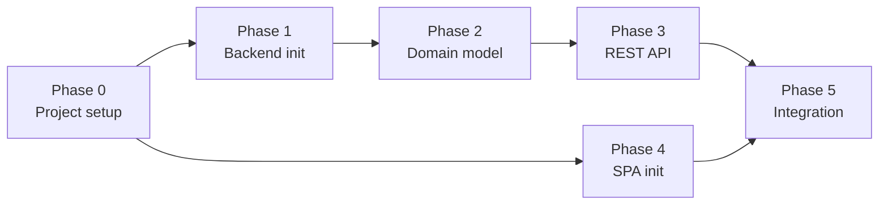
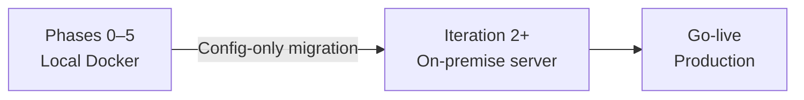

# Implementation Plan — SAPCyTI

## 1. Introduction

This document is the **central index** for the SAPCyTI implementation plan. Per-phase task detail, checkboxes, and progress notes live in separate files. The [`progress.md`](progress.md) file is the **project memory**: current state, decisions, and open items.

**Deployment strategy:**

| Stage | Environment | Infrastructure | When |
|-------|-------------|----------------|------|
| **Development** | Local with Docker | PostgreSQL, Backend API, and Angular SPA in Docker Compose | Phases 0–5 (current) |
| **Pre-production / Production** | On-premise Linux server | Namespaced Docker Compose projects (`sapcyti-dev`, `sapcyti-preprod`, `sapcyti-prod`) | After Phase 5, CI/CD integration |

All development and testing run **locally with Docker**. The architecture is cloud-ready from day one (environment variables, no host path dependencies, portable Docker images) so cloud migration (QA-5) is infrastructure configuration, not code rewrites.

| File | Content |
|------|---------|
| [`implementationPlan.md`](implementationPlan.md) | This file — overview, dependencies, stack, transition criteria |
| [`progress.md`](progress.md) | Project memory — phase status, decisions, blockers |
| [`phase0.md`](phase0.md) | Phase 0 — Project setup and configuration |
| [`phase1.md`](phase1.md) | Phase 1 — Backend project initialization |
| [`phase2.md`](phase2.md) | Phase 2 — Domain model and persistence |
| [`phase3.md`](phase3.md) | Phase 3 — Application layer and REST API |
| [`phase4.md`](phase4.md) | Phase 4 — SPA project initialization (Angular) |
| [`phase5.md`](phase5.md) | Phase 5 — Integration, Docker and verification |

---

## 2. Phase Overview

| Phase | Name | Primary goal | ADD iteration |
|-------|------|--------------|---------------|
| **0** | Project setup and configuration | Repositories, quality tools, CI/CD pipelines, local environment, documentation | Iteration 1 (pre-requisite) |
| **1** | Backend project initialization | Spring Boot project with hexagonal package structure and multi-tenant support | Iteration 1 |
| **2** | Domain model and persistence | GraduateProgram, ConfigurationParameter, JPA adapters, Flyway migrations | Iteration 1 |
| **3** | Application layer and REST API | Input/output ports, use cases, REST controllers, Configuration Adapter, Actuator | Iteration 1 |
| **4** | SPA project initialization | Angular project with Core, Shared, Shell, tenant context, responsive layout | Iteration 1 |
| **5** | Integration, Docker and verification | Dockerize both projects, Docker Compose stack, end-to-end verification | Iteration 1 |

---

## 3. Phase Dependencies

| Phase | Depends on | Reason |
|-------|------------|--------|
| **1** | 0 | Requires repositories, CI/CD pipelines, and quality tools configured |
| **2** | 1 | Requires Spring Boot project with hexagonal package structure |
| **3** | 2 | Requires domain model, ports, and JPA adapters in place |
| **4** | 0 | Requires repository, ESLint, coverage tools configured |
| **5** | 3, 4 | Requires both backend API and SPA projects functional |

---

## 4. Phase Transition Criteria

To move from one phase to the next, **all** of the following must hold:

| Criterion | Description |
|-----------|-------------|
| **Deliverables complete** | Every deliverable for the phase is produced and verified |
| **Tests pass** | Unit and integration test suites pass at 100% in CI |
| **Coverage met** | ≥ 80% code coverage (JaCoCo for backend, istanbul for SPA) |
| **No regressions** | Functionality from earlier phases still works |
| **Hexagonal conventions** | New code follows the hexagonal package layout from §6.1 of Architecture.md |
| **Documentation updated** | README, API docs, and architecture diagrams are current |

---

## 5. Driver Traceability by Phase

| Category | Drivers | Phase |
|----------|---------|-------|
| **DevOps setup** | CON-6 (student developers, structured process) | 0 |
| **Backend structure** | CON-1 (Java + OSS), CON-6 (modular monolith), QA-4 (multi-tenant) | 1 |
| **Domain model** | QA-3 (parameterization), QA-4 (multi-tenant), CON-1 (Java) | 2 |
| **API layer** | QA-3 (parameterization), QA-4 (multi-tenant), CON-5 (flexible rules), CON-6 | 3 |
| **Frontend** | CON-7 (browsers, responsive), CON-6 (predictable structure), QA-4 (tenant) | 4 |
| **Deployment** | CON-2 (on-premise), QA-5 (cloud portability), CON-3 (export), CON-4 (WordPress) | 5 |

---

## 6. Selected Technology Stack

**Frontend:** Angular 17+ + TypeScript + SCSS  
**Backend:** Spring Boot 3.x (Java 21) + Spring Data JPA + PostgreSQL

### Stack libraries

| Layer | Library | Purpose |
|-------|---------|---------|
| **Backend — core** | Spring Boot 3.x, Spring Web, Spring Data JPA, Spring Validation | Base framework, REST API, persistence, validation |
| **Backend — persistence** | Hibernate 6.x, PostgreSQL JDBC, Flyway | ORM, database driver, versioned migrations |
| **Backend — observability** | Spring Boot Actuator, Micrometer | Health checks, metrics, monitoring |
| **Backend — logging** | SLF4J, Logback, logstash-logback-encoder | Structured JSON logging (Factor XI) |
| **Backend — mapping** | MapStruct | Compile-time DTO ↔ Domain mapping |
| **Backend — testing** | JUnit 5, Mockito, Spring Boot Test, JaCoCo | Unit/integration tests, coverage |
| **Backend — security scan** | OWASP Dependency-Check | CVE scanning in CI |
| **Frontend — core** | Angular 17+, TypeScript 5.x, Angular CLI | SPA framework, static typing, tooling |
| **Frontend — HTTP** | Angular HttpClient | REST client with interceptors |
| **Frontend — testing** | Karma, Jasmine, istanbul/nyc | Unit tests, coverage |
| **Frontend — linting** | ESLint, @angular-eslint | Code quality enforcement |
| **DevOps** | Docker, Docker Compose, GitHub Actions | Containers, orchestration, CI/CD |
| **Reverse proxy** | Nginx | Static assets, reverse proxy, security headers |

---

## 7. Environment Strategy: Local Docker → On-Premise

### Principle

> **Develop and validate everything locally with Docker. Deploy to the on-premise server when functionality is proven and stable.**

### Environment phases

### Cloud-ready rules from day one

| Rule | Description | Example |
|------|-------------|---------|
| **Environment variables** | All external configuration via env vars, never hardcoded | `DB_URL`, `CORS_ALLOWED_ORIGINS`, `SPRING_PROFILES_ACTIVE` |
| **No local paths** | No dependency on host filesystem paths | Docker volumes for persistent data |
| **Portable Docker images** | Multi-stage builds runnable on any container runtime | Same image for local Docker and on-premise server |
| **Health checks** | Actuator endpoints from Phase 3 | `/actuator/health`, `/actuator/prometheus` |
| **Versioned migrations** | Flyway manages schema; no manual SQL | Scripts under `db/migration/V{N}__*.sql` |
| **Structured logs** | JSON logging compatible with aggregators | logstash-logback-encoder; no `System.out.println` |

### What changes when moving to on-premise server (Iteration 2+)

| Component | Local Docker | On-Premise Server |
|-----------|--------------|-------------------|
| **PostgreSQL** | Docker container with local volume | Docker container with named volume on Linux host |
| **API Server** | Docker container on `localhost:8080` | Docker container in namespaced Compose project |
| **SPA Client** | `ng serve` dev server | Static build served by Nginx container |
| **CI/CD** | Local validation | GitHub Actions → GHCR → SSH deploy |
| **Secrets** | Local `.env` file | `.env.{dev,preprod,prod}` on server |
| **TLS** | Optional locally | Nginx TLS termination |
| **Monitoring** | Actuator only | VictoriaMetrics + Node Exporter + Grafana |
