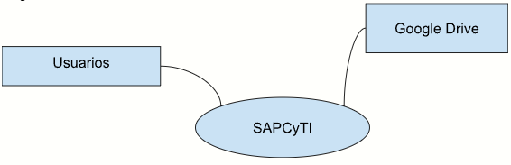

# SISTEMA DE ADMINISTRACIÓN DEL POSGRADO EN CIENCIAS Y TECNOLOGÍAS DE LA INFORMACIÓN (SAPCyTI)

#### Documento de Visión y Alcance

- **Autor**: Humberto Cervantes Maceda
- **Fecha**: 23/02/2026

---

## 1. Requerimientos de Negocio

### 1.1 Antecedentes

La Universidad Autónoma Metropolitana (UAM) ofrece actualmente 62 posgrados. El proceso de administración del posgrado en Ciencias y Tecnologías de la Información es principalmente manual y se apoya en herramientas como Excel, lo que genera los siguientes problemas:

- Necesidad de dedicar mucho tiempo a aspectos administrativos.

- Dificultad para disponer de información veraz y oportuna en distintos sistemas (Sitio Web, Excel, Conacyt).

- Requerimiento de generar paquetes de evidencia para evaluaciones continuas del Conacyt.

### 1.2 Oportunidad de Negocio

La creación de un sistema que automatice parcialmente los procesos permitiría reducir tiempos administrativos y mejorar la toma de decisiones. No existe un producto comercial que se adapte a las características particulares de operación de este posgrado.

### 1.3 Objetivos de Negocio

| ID       | Descripción del objetivo de negocio                                                 |
| -------- | ----------------------------------------------------------------------------------- |
| **ON-1** | Formar investigadores, profesores y profesionales de alto nivel en el área de CyTI. |

### 1.4 Necesidades del Cliente

| ID        | Descripción de la necesidad                                                                                                             |
| --------- | --------------------------------------------------------------------------------------------------------------------------------------- |
| **NEC-1** | Información precisa y actualizada sobre estudiantes y el posgrado.                                                                      |
| **NEC-2** | Portal para alumnos y profesores para realizar actividades asociadas al programa.                                                       |
| **NEC-3** | Reducir el esfuerzo administrativo.                                                                                                     |
| **NEC-4** | Facilitar la generación de evidencias para el SNP de Conacyt.                                                                          |
| **NEC-5** | Integración técnica con los Sistemas de Control Escolar para eliminar intermediarios en el registro.                                    |
| **NEC-6** | Independencia del sistema "Virtuami" para la gestión de documentos de aspirantes, evitando pérdida de datos o actualizaciones externas. |
| **NEC-7** | Internacionalización del sistema para soportar convenios de doble titulación.                                                           |

### 1.5 Riesgos de Negocio

- **Tiempo de desarrollo:** Debido a que será realizado por alumnos de licenciatura con poca experiencia y estancias cortas, el cronograma podría extenderse.

## 2. Visión de la Solución

### 2.1 Frase de Visión

Para la comunidad del PCyTI que no dispone de un sistema de soporte, **SAPCyTI** es un portal web que gestiona centralizadamente las actividades del posgrado, diferenciándose de herramientas genéricas por ser un sistema hecho a la medida.

### 2.2 Características Principales

### 2.2.1 Características funcionales

### Características del documento original

| ID         | Descripción                                                                                                                                                                                                                                                                                                                                                                                                                    | Prioridad    | Necesidad asociada       |
| :--------- | :----------------------------------------------------------------------------------------------------------------------------------------------------------------------------------------------------------------------------------------------------------------------------------------------------------------------------------------------------------------------------------------------------------------------------- | :----------- | :----------------------- |
| **CAR-1**  | El sistema debe generar páginas o reportes bajo el formato que solicita Conacyt para que alguna persona pueda llenarlo de forma simple (copy/paste)                                                                                                                                                                                                                                                                            | Media        | ON-1                     |
| **CAR-2**  | El sistema debe proporcionar mecanismos que permitan a los estudiantes, profesores y asistentes administrativos subir los productos de trabajo que se requieren como evidencia de Conacyt                                                                                                                                                                                                                                      | Alta         | ON-1                     |
| **CAR-3**  | El sistema debe proporcionar mecanismos para respaldar la información.                                                                                                                                                                                                                                                                                                                                                         | Media        | ON-1                     |
| **CAR-4**  | El sistema debe proporcionar mecanismos de seguridad para evitar accesos o modificaciones indeseados.                                                                                                                                                                                                                                                                                                                          | Alta         | ON-1                     |
| **CAR-5**  | El sistema debe automatizar los procesos de organización del posgrado.                                                                                                                                                                                                                                                                                                                                                         | Baja         | ON-2   ON-8           |
| **CAR-6**  | El sistema debe proporcionar mecanismos para administrar el seminario de CyTI incluyendo envío de correos, generación de carteles y reconocimientos, invitar ponentes, calendarizar ponentes.                                                                                                                                                                                                                                  | Alta         |                          |
| **CAR-7**  | El sistema debe permitir editar las páginas con contenido estático de forma simple y generar las demás de forma automática                                                                                                                                                                                                                                                                                                     | Alta / Media | ON-2                     |
| **CAR-8**  | El sistema debe proporcionar mecanismos que permitan a los usuarios actualizar los datos relacionados con sus productos de trabajo y subirlos al sistema                                                                                                                                                                                                                                                                       | Alta         | ON-3                     |
| **CAR-9**  | El sistema debe permitir hacer predicciones sobre la disponibilidad del personal académico para la dirección de tesis en el proceso de admisión.                                                                                                                                                                                                                                                                               | Media        | ON-4                     |
| **CAR-10** | El sistema debe permitir administrar los recursos como lugares de trabajo y equipos de computo                                                                                                                                                                                                                                                                                                                                 | Alta         | ON-5                     |
| **CAR-11** | El sistema debe permitir gestionar el presupuesto del posgrado y administrar solicitudes de apoyo.                                                                                                                                                                                                                                                                                                                             | Media        | ON-6   ON-2           |
| **CAR-12** | El sistema debe generar un sitio que sea fácil de navegar (intuitivo)                                                                                                                                                                                                                                                                                                                                                          | Baja         | ON-9                     |
| **CAR-13** | El sistema debe poder ser adecuado a necesidades de otros posgrados de forma simple                                                                                                                                                                                                                                                                                                                                            | Baja         | ON-7                     |
| **CAR-14** | El sistema debe permitir automatizar tareas “mecánicas” de la coordinación que incluyen: • Comunicar seminarios • Generar tablas y gráficas para reportes diversos • Enviar avisos a todos los participantes o grupos específicos • Organización de presentaciones trimestrales • Organización de exámenes (maestría, predoctoral, doctorado) • Autorizaciones de materias • Administración de los gastos | Alta         | ON-2                     |
| **CAR-15** | El sistema debe generar y publicar las siguientes páginas de la página web de forma automática: • Planeación • Profesores • Alumnos • Seminarios • Publicaciones                                                                                                                                                                                                                                                | Alta         | ON-2   ON-3   ON-9 |
| **CAR-16** | La generación de las partes dinámicas de la página debe hacerse en un tiempo aceptable (TBD)                                                                                                                                                                                                                                                                                                                                   | Media        |                          |
| **CAR-17** | El sistema debe soportar una carga aceptable (TBD) durante los momentos pico                                                                                                                                                                                                                                                                                                                                                   | Media        |                          |
| **CAR-18** | El sistema debe poder cargar información de fuentes diversas como pueden ser: • Reportes generados por páginas del conacyt • Reportes generados por sistemas escolares                                                                                                                                                                                                                                                   | Alta         | ON-1                     |
| **CAR-19** | El sistema debe ser accesible desde dispositivos móviles                                                                                                                                                                                                                                                                                                                                                                       | Baja         | ON-9                     |
| **CAR-20** | El sistema debe permitir adecuar las partes variables asociadas a otros posgrados de forma simple                                                                                                                                                                                                                                                                                                                              | Media        | ON-7                     |
| **CAR-21** | El sistema debe permitir la exportación de datos de inscripción en formatos TXT o XLSX compatibles con los requerimientos específicos de Sistemas Escolares (Lic. César Hernández).                                                                                                                                                                                                                                            | Alta         |
| **CAR-22** | El sistema debe integrarse con la API de WordPress para actualizar automáticamente las propuestas de proyectos, alumnos y seminarios en el sitio web del posgrado.                                                                                                                                                                                                                                                             | Alta         |
| **CAR-23** | El sistema debe gestionar el proceso completo de admisión, permitiendo a los aspirantes subir documentos y a la comisión evaluar y decidir aceptaciones sin depender de sistemas externos.                                                                                                                                                                                                                                     | Alta         |
| **CAR-24** | El sistema debe incluir la gestión de proyectos de investigación: desde la carga de propuestas por profesores hasta la selección y asignación de temas a los alumnos.                                                                                                                                                                                                                                                          | Media        |
| **CAR-25** | El sistema debe generar notificaciones automáticas en redes sociales (Facebook) y el canal de YouTube para la difusión de seminarios.                                                                                                                                                                                                                                                                                          | Baja         |
| **CAR-26** | El sistema debe automatizar la gestión de la Comisión del Posgrado: registro de entrada/salida de miembros y generación de cartas de nombramiento para el director.                                                                                                                                                                                                                                                            | Media        |
| **CAR-27** | El sistema debe calcular estadísticas de desempeño académico (tasas de graduación por generación, porcentajes de ingreso vs. egreso) necesarias para las evaluaciones del SNP.                                                                                                                                                                                                                                                 | Alta         |

### Características obtenidas por el agente:

| ID         | Módulo / Proceso | Descripción                                                                                                                                                | Prioridad | Estado de Certeza / Restricciones                    | Necesidad asociada |
| :--------- | :--------------- | :--------------------------------------------------------------------------------------------------------------------------------------------------------- | :-------- | :--------------------------------------------------- | :----------------- |
| **CAR-01** | Admisión         | Registro de aspirantes y carga de documentos comprobatorios para la formación de expedientes.                                                              | Alta      | Confirmado (Prioridad Táctica)                       | NEC-6              |
| **CAR-02** | Admisión         | Evaluación de expedientes y registro de decisiones de la comisión.                                                                                         | Alta      | Depende de validación institucional externa          | NEC-6              |
| **CAR-03** | Admisión         | Estimación y visualización de la disponibilidad del personal académico para la dirección de tesis.                                                         | Alta      | Confirmado                                           | NEC-6              |
| **CAR-04** | Inscripción      | Selección de unidades de enseñanza aprendizaje (UEA) por alumnos y flujo de aprobación por tutores/asesores.                                               | Alta     | Confirmado (Base Legacy)                             | NEC-3              |
| **CAR-05** | Inscripción      | Generación de formato de inscripción y exportación compatible con Sistemas de Control Escolar (TXT/XLSX).                                                  | Alta     | Formato exacto pendiente de validar                  | NEC-5              |
| **CAR-06** | Planeación       | Creación y edición paramétrica de planes anuales y trimestrales (materias, grupos, profesores, cupo, horarios).                                            | Alta     | Confirmado (Base Legacy)                             | NEC-3              |
| **CAR-07** | Seminarios       | Gestión del seminario (calendarización, captura de título/resumen, generación de invitaciones y reconocimientos).                                          | Media     | Confirmado (Base Legacy)                             | NEC-3              |
| **CAR-08** | Difusión         | Integración con WordPress y redes sociales para publicar automáticamente eventos, proyectos y alumnos.                                                     | Baja     | Pendiente de validar detalles API                    | NEC-2              |
| **CAR-09** | Gestión Alumnos  | Administración del registro y expediente de alumnos, así como la asignación de tutores y comités.                                                          | Alta     | Confirmado                                           | NEC-1              |
| **CAR-10** | Procesos Académ. | Gestión y seguimiento de presentaciones trimestrales, exámenes predoctorales, de maestría y de grado.                                                      | Media     | Requiere Definición Funcional detallada              | NEC-3              |
| **CAR-11** | Gestión Prof.    | Administración de datos de profesores, control del núcleo académico y alumnos asesorados.                                                                  | Media     | Confirmado                                           | NEC-1              |
| **CAR-12** | Investigación    | Registro de proyectos de investigación y flujo de asignación con alumnos.                                                                                  | Media     | Confirmado                                           | NEC-3              |
| **CAR-13** | Evaluaciones     | Recolección de evidencias y productos de trabajo para el SNP/Conacyt de estudiantes y profesores.                                                          | Media     | Confirmado                                           | NEC-4              |
| **CAR-14** | Evaluaciones     | Generación de reportes y estadísticas de desempeño académico para el POEP y SNP.                                                                           | Media     | Criterios formales pendientes de validar             | NEC-4              |
| **CAR-15** | Integración      | Importación/actualización de datos provenientes de sistemas institucionales o externos (SAP, Conacyt).                                                     | Media     | No asumir como cerrado (depende de APIs o archivos)  | NEC-5              |
| **CAR-16** | Administración   | Gestión del presupuesto, apoyo a alumnos y administración de recursos físicos.                                                                             | Baja      | Requiere Definición Funcional                        | NEC-3              |
| **CAR-17** | No Funcionales   | Requisitos transversales: Respaldos de información, seguridad, control de carga, tiempos de respuesta óptimos y disponibilidad en móviles.                 | Media     | Parcialmente definido                                | NEC-2              |
| **CAR-18** | Escalabilidad    | Capacidad paramétrica para adecuar partes variables de la operación a fin de escalar a otros posgrados, e internacionalización (soporte a idioma inglés).  | Baja      | Parcialmente definido                                | NEC-7              |

## 3. Alcance y Limitaciones

### 3.1 Plan de Liberaciones

| Entrega | Tema Principal                                   | Características        |
| ------- | ------------------------------------------------ | ---------------------- |
| **1.0** | Reducción de tiempo y colecta de evidencias SNP | CAR-2, 4, 6, 8, 10     |
| **2.0** | Generación de reportes SNP                      | CAR-7, 14, 15, 18, 1   |
| **3.0** | Facilitar transición de coordinador              | CAR-3, 9, 11, 16, 5    |
| **4.0** | Transición a otros posgrados                     | CAR-17, 20, 12, 13, 19 |

## 4. Contexto de Negocio

### 4.1 Perfiles de involucrados

### Resumen de Involucrados

| Nombre                    | Descripción                           | Responsabilidades                                                                                                                                                           |
| :------------------------ | :------------------------------------ | :-------------------------------------------------------------------------------------------------------------------------------------------------------------------------- |
| Humberto Cervantes        | Coordinador del Posgrado en CyTI      | • Aprobar visión • Validar requerimientos • Proporcionar documentación requerida por el Conacyt. • Aprobar entregas del proyecto.                                  |
|                           | Profesores                            | • Proporcionar requerimientos • Validar prototipos de interfaz de usuario                                                                                                |
|                           | Alumnos                               | • Proporcionar requerimientos • Validar prototipos de interfaz de usuario                                                                                                |
| Iseo                      | Asistente administrativa del posgrado | • Proporcionar requerimientos • Validar prototipos de interfaz de usuario                                                                                                |
| Tere                      | Coordinadora divisional               | • Proporcionar requerimientos • Validar prototipos de interfaz de usuario                                                                                                |
|                           | Coordinador de otro posgrado          | • Proporcionar requerimientos • Validar prototipos de interfaz de usuario                                                                                                |
| José Antonio de los Reyes | Director de la división               | • Proporcionar recursos y apoyo                                                                                                                                             |
| Paulina Valencia          | Líder de proyecto                     | • Participar en todas las actividades del desarrollo                                                                                                                        |
| César Hernández           | Sistemas Escolares                    | • Responsable de definir los formatos de intercambio de información (TXT/Excel) para que la inscripción interna del SAPCyTI se refleje en los sistemas centrales de la UAM. |

### 4.2 Prioridades del proyecto

### 4.3 Entorno de Operación

El sistema será utilizado por el personal académico de la coordinación del posgrado mediante computadoras y otros dispositivos conectados a la red inalámbrica del posgrado de CyTI.

El sistema se desplegará en un servidor local dedicado como entorno definitivo de operación, con las siguientes características:
- SO: Distribución de Linux
- Almacenamiento: 16 TB
- Memoria RAM: 32 GB

El entorno de operación debe garantizar la exportación de datos compatible con los sistemas escolares mencionados (SAP, Virtuami, Control Escolar) y el marco POEP, asegurando capacidad de respuesta para la robusta generación de reportes e informes.

El sistema será utilizado mediante un navegador web (Chrome 130, Safari 22, Firefox 129).

El sistema y sus nuevas funciones de reporte (POEP) serán plenamente responsivos para su uso en tablets y teléfonos inteligentes.

Diagrama de contexto:

